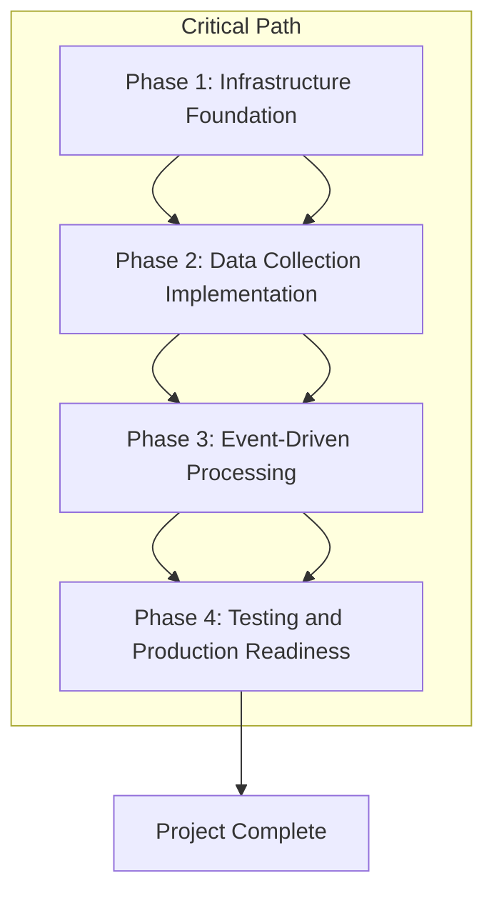

# Project Roadmap: Signal9 Data Collection System

## Project Overview
Signal9 Data Collection System is a serverless AWS-based data ingestion and storage platform designed to collect, validate, and store financial data from external APIs. The system serves as the foundational data layer for future investment analysis applications, focusing exclusively on reliable data collection, processing, and storage without any user-facing components.

## Strategic Context
- **Business Goals**: Build a reliable, monitored data collection foundation that serves as the backbone for future investment analysis applications
- **Success Metrics**: >95% data validation success rate, >99% system uptime, 100% scheduled job completion
- **Timeline**: Four sequential phases over 8 weeks to build complete data collection system

## Phase Overview

### Phase 1: Infrastructure Foundation
- **Name**: Infrastructure Foundation
- **Duration**: 2 weeks
- **Priority**: Critical
- **Status**: Not Started

### Phase 2: Data Collection Implementation
- **Name**: Data Collection Implementation
- **Duration**: 2 weeks
- **Priority**: Critical
- **Status**: Not Started

### Phase 3: Event-Driven Processing
- **Name**: Event-Driven Processing
- **Duration**: 2 weeks
- **Priority**: Critical
- **Status**: Not Started

### Phase 4: Testing and Production Readiness
- **Name**: Testing and Production Readiness
- **Duration**: 2 weeks
- **Priority**: Critical
- **Status**: Not Started

## Phase 1: Infrastructure Foundation

#### Business Context
- **Business Value**: Establishes the foundational AWS infrastructure required for all data collection operations
- **Success Metrics**: 
  - All AWS resources deployed successfully
  - DynamoDB tables operational with proper schemas
  - Lambda functions deployable via CDK
  - Basic monitoring configured

#### Technical Scope
- **Components**: 
  - AWS CDK infrastructure as code setup
  - DynamoDB table creation and configuration
  - Lambda function structure and deployment framework
  - EventBridge rule configuration
  - Secrets Manager setup for API credentials
- **Technical Dependencies**: 
  - AWS CDK for infrastructure as code
  - GitHub Actions for CI/CD pipeline setup
  - AWS IAM permissions and roles
- **Architecture Changes**: Complete serverless infrastructure deployment from greenfield

#### Implementation
- **Key Deliverables**:
  - **AWS CDK Setup**: Infrastructure as code with TypeScript
  - **DynamoDB Tables**: Create and configure all 4 data tables with proper indexes:
    - assets: Store tradable asset information
    - earningsCalendar: Store earnings dates and processing status
    - newsSentiment: Store filtered news with asset associations
    - foundationalData: Store comprehensive financial data from AlphaVantage
  - **Lambda Function Structure**: Implement core Lambda function deployment framework
  - **EventBridge Configuration**: Set up scheduled rules and custom event routing
  - **Secrets Management**: Configure AWS Secrets Manager for API credentials
  - **Basic Monitoring**: CloudWatch logging and basic metrics

- **Technical Constraints**: 
  - Monday-Saturday scheduling requirements
  - AWS resource limits and quotas
  - CDK deployment patterns

- **Integration Points**:
  - AWS Secrets Manager for API credential management
  - GitHub Actions for automated deployment pipeline
  - CloudWatch for logging and monitoring

#### Quality Assurance
- **Testing Requirements**:
  - Unit Testing: CDK infrastructure tests
  - Integration Testing: AWS resource creation validation
  - Performance Testing: DynamoDB table performance validation
- **Security Requirements**:
  - Security Reviews: AWS IAM policy review
  - Compliance Checks: AWS security best practices

#### Risk Management
- **Identified Risks**:
  - AWS Resource Creation Failures:
    - Impact: High
    - Probability: Medium
    - Mitigation Strategy: Comprehensive CDK testing, incremental deployment approach
  - IAM Permission Issues:
    - Impact: Medium
    - Probability: Medium
    - Mitigation Strategy: Pre-validate IAM policies, follow least privilege principle
- **Contingency Plans**: Manual AWS resource creation if CDK fails, alternative deployment approaches

#### Exit Criteria
- **Technical Criteria**:
  - All 4 DynamoDB tables created with proper schemas and indexes
  - All 7 Lambda function placeholders deployed successfully
  - EventBridge rules configured for Monday-Saturday scheduling
  - Secrets Manager configured with placeholder credentials
- **Business Criteria**:
  - Infrastructure cost estimates validated
  - Security review completed
- **Documentation**: Infrastructure documentation, deployment procedures
- **Performance Metrics**: CDK deployment time <30 minutes, all resources healthy

## Phase 2: Data Collection Implementation

#### Business Context
- **Business Value**: Implements core data collection capabilities from external APIs
- **Success Metrics**: 
  - Asset sync success rate >98%
  - Earnings sync success rate >98%
  - News sync success rate >95%
  - Data validation success rate >95%

#### Technical Scope
- **Components**: 
  - SyncAssets Lambda function with Alpaca API integration
  - SyncEarningsCalendar Lambda function with AlphaVantage integration
  - SyncNewsSentiment Lambda function with hourly processing
  - Comprehensive data validation logic
  - Error handling and retry mechanisms
- **Technical Dependencies**: 
  - Phase 1 infrastructure completion
  - AlphaVantage API access
  - Alpaca API access
- **Architecture Changes**: Implementation of scheduled data collection workflows

#### Implementation
- **Key Deliverables**:
  - **Asset Sync**: Implement SyncAssets function with Alpaca API integration
  - **Earnings Sync**: Implement SyncEarningsCalendar function with AlphaVantage integration
  - **News Collection**: Implement SyncNewsSentiment function with hourly processing
  - **Data Validation**: Implement comprehensive validation logic for all data sources
  - **Error Handling**: Implement retry logic and error recovery mechanisms

- **Technical Constraints**: 
  - API rate limits (mitigated with full AlphaVantage access)
  - Lambda timeout constraints (5 minutes for data collection functions)
  - DynamoDB write capacity management

- **Integration Points**:
  - AlphaVantage API endpoints: EARNINGS_CALENDAR, NEWS_SENTIMENT
  - Alpaca API: `/v2/assets?status=active` endpoint
  - DynamoDB tables for data storage

#### Quality Assurance
- **Testing Requirements**:
  - Unit Testing: >80% coverage for data collection functions
  - Integration Testing: API integration validation with mocked responses
  - Performance Testing: Lambda execution time validation
- **Security Requirements**:
  - Security Reviews: API credential handling review
  - Compliance Checks: Data handling compliance for financial data

#### Risk Management
- **Identified Risks**:
  - External API Outages:
    - Impact: High
    - Probability: Medium
    - Mitigation Strategy: Comprehensive error handling, retry logic with exponential backoff
  - Data Quality Issues:
    - Impact: High
    - Probability: Medium
    - Mitigation Strategy: Multi-layer validation, data consistency checks
- **Contingency Plans**: Manual data collection procedures, API fallback strategies

#### Exit Criteria
- **Technical Criteria**:
  - All 3 scheduled data collection functions operational
  - Data validation logic implemented and tested
  - Error handling with retry logic functional
  - Monday-Saturday scheduling operational
- **Business Criteria**:
  - >95% data validation success rate achieved
  - All scheduled jobs completing successfully
- **Documentation**: Data collection documentation, API integration guides
- **Performance Metrics**: All functions executing within timeout limits, API calls completing within 30 seconds

## Phase 3: Event-Driven Processing

#### Business Context
- **Business Value**: Enables asset-specific comprehensive data collection through event-driven architecture
- **Success Metrics**: 
  - Event processing latency <30 seconds
  - Pollination success rate >95%
  - Complete historical dataset processing operational

#### Technical Scope
- **Components**: 
  - TriggerEarningsPollenation and TriggerRegularPollenation Lambda functions
  - PollenateAsset Lambda function with full AlphaVantage integration
  - MarkEarningsProcessed Lambda function
  - Event orchestration and dispatch logic
  - Bulk upsert operations for historical datasets
- **Technical Dependencies**: 
  - Phase 2 data collection completion
  - EventBridge custom event configuration
  - AlphaVantage fundamental data APIs
- **Architecture Changes**: Implementation of event-driven data processing workflows

#### Implementation
- **Key Deliverables**:
  - **Pollination Triggers**: Implement TriggerEarningsPollenation and TriggerRegularPollenation
  - **Asset Data Collection**: Implement PollenateAsset function with full AlphaVantage integration:
    - COMPANY_OVERVIEW
    - EARNINGS (complete historical datasets)
    - CASH_FLOW (complete historical datasets)
    - BALANCE_SHEET (complete historical datasets)
    - INCOME_STATEMENT (complete historical datasets)
  - **Event Processing**: Implement MarkEarningsProcessed function
  - **Event Orchestration**: Ensure proper event dispatch and handling
  - **Bulk Data Processing**: Complete foundational data storage with bulk upsert strategy

- **Technical Constraints**: 
  - 10 minute Lambda timeout for comprehensive data processing
  - Bulk upsert of complete historical datasets (20-50 records per financial statement type)
  - EventBridge event size limitations

- **Integration Points**:
  - AlphaVantage API endpoints: OVERVIEW, EARNINGS, CASH_FLOW, BALANCE_SHEET, INCOME_STATEMENT
  - EventBridge for pollenationNeeded and earningsProcessed events
  - DynamoDB foundational data tables

#### Quality Assurance
- **Testing Requirements**:
  - Unit Testing: >90% coverage for critical event processing functions
  - Integration Testing: Event flow validation
  - Performance Testing: Bulk data processing validation
- **Security Requirements**:
  - Security Reviews: Event data security validation
  - Compliance Checks: Financial data processing compliance

#### Risk Management
- **Identified Risks**:
  - Event Processing Complexity:
    - Impact: Medium
    - Probability: Medium
    - Mitigation Strategy: Modular event processing design, comprehensive testing
  - Bulk Data Processing Performance:
    - Impact: Medium
    - Probability: Medium
    - Mitigation Strategy: Optimized DynamoDB batch writes, Lambda memory sizing
- **Contingency Plans**: Manual event triggering, simplified processing workflows

#### Exit Criteria
- **Technical Criteria**:
  - All event-driven functions operational
  - pollenationNeeded and earningsProcessed events working
  - Bulk historical dataset processing functional
  - Dual pollination strategy (earnings and regular) operational
- **Business Criteria**:
  - Event processing completing within 30 seconds
  - Complete historical datasets being processed correctly
- **Documentation**: Event processing documentation, troubleshooting guides
- **Performance Metrics**: All event functions executing within timeout limits

## Phase 4: Testing and Production Readiness

#### Business Context
- **Business Value**: Ensures system reliability and production readiness for ongoing operations
- **Success Metrics**: 
  - Unit test coverage >80% overall, >90% for critical functions
  - System uptime >99% in production
  - All production deployment procedures operational

#### Technical Scope
- **Components**: 
  - Comprehensive unit test suite with Jest and TypeScript
  - GitHub Actions CI/CD pipeline with CDK CLI deployment
  - Advanced CloudWatch monitoring and alerting
  - Production deployment with monitoring validation
  - Tag-based deployment strategy with rollback capability
- **Technical Dependencies**: 
  - Phase 3 event processing completion
  - GitHub Actions configuration
  - Production AWS environment setup
- **Architecture Changes**: Production monitoring and deployment pipeline implementation

#### Implementation
- **Key Deliverables**:
  - **Unit Testing**: Comprehensive test suite with >80% coverage
  - **GitHub Actions Setup**: Configure CI/CD pipeline with CDK CLI deployment
  - **Tag-based Deployment**: Implement production deployment strategy with rollback capability
  - **Monitoring Enhancement**: Advanced CloudWatch dashboards and alerting
  - **Maintenance Window**: Configure Sunday maintenance window (disable scheduled jobs)
  - **Documentation**: Complete system documentation and operational procedures
  - **Production Deployment**: Deploy to production environment with monitoring
  - **Performance Validation**: Validate system performance and data quality metrics

- **Technical Constraints**: 
  - Production deployment requirements
  - Monitoring and alerting thresholds
  - Rollback procedure validation

- **Integration Points**:
  - GitHub Actions for automated deployment
  - CloudWatch for comprehensive monitoring
  - Production AWS environment

#### Quality Assurance
- **Testing Requirements**:
  - Unit Testing: >80% coverage overall, >90% for critical data processing functions
  - Integration Testing: End-to-end system validation
  - Performance Testing: Production load validation
- **Security Requirements**:
  - Security Reviews: Complete security audit
  - Compliance Checks: Production security compliance

#### Risk Management
- **Identified Risks**:
  - Production Deployment Issues:
    - Impact: High
    - Probability: Medium
    - Mitigation Strategy: Comprehensive testing, staged deployment approach
  - Monitoring Gaps:
    - Impact: Medium
    - Probability: Medium
    - Mitigation Strategy: Thorough monitoring validation, alert testing
- **Contingency Plans**: Manual deployment procedures, alternative monitoring approaches

#### Exit Criteria
- **Technical Criteria**:
  - Unit test coverage targets achieved
  - GitHub Actions CI/CD pipeline operational with tag-based deployments
  - CloudWatch monitoring and alerting fully configured
  - Production deployment successful with all functions operational
- **Business Criteria**:
  - >99% system uptime achieved in production
  - All scheduled jobs completing successfully within time windows
  - Data quality metrics meeting targets
- **Documentation**: Complete system documentation, operational procedures, troubleshooting guides
- **Performance Metrics**: All system performance targets met in production

## Phase Dependencies


## Technical Architecture Overview
- **Architecture Pattern**: Event-driven serverless architecture with scheduled cron jobs and custom event processing
- **Key Technologies**: 
  - AWS Lambda (Node.js v22, TypeScript)
  - DynamoDB (on-demand billing)
  - EventBridge (scheduled rules and custom events)
  - CloudWatch (monitoring, metrics, alarms)
  - AWS CDK (infrastructure as code)
- **Integration Strategy**: RESTful API integration with external data providers, event-driven internal communication
- **Scalability Considerations**: On-demand DynamoDB scaling, bulk upsert operations for historical datasets, Lambda concurrency management

### **Scheduled Data Collection Workflow**
```
Monday-Saturday Schedule:
4:00 AM: Asset Sync (Alpaca API) → assets Table
5:00 AM: Earnings Calendar Sync (AlphaVantage API) → earningsCalendar Table
6:00 AM: Earnings-Triggered Pollination → pollenationNeeded Events for recent earnings
7:00 AM: Regular Pollination → pollenationNeeded Events for high-volume, stale assets
Hourly: News Sentiment Sync → newsSentiment Table with asset associations

Sunday: Maintenance Window (no scheduled jobs run)
```

### **Event-Driven Data Processing**
- **pollenationNeeded Events**: Trigger comprehensive financial data collection for specific assets (from both earnings and regular triggers)
- **earningsProcessed Events**: Mark earnings as processed to prevent duplicate collection
- **Dual Pollination Sources**: Events triggered by both earnings releases (6:00 AM) and regular data staleness checks (7:00 AM)
- **Bulk Historical Data Processing**: Each pollination re-processes complete historical datasets (typically 10+ years of financial data)

## Security and Compliance
- **Security Framework**: AWS IAM roles with minimal permissions, API credentials in Secrets Manager
- **Compliance Requirements**: Financial data handling compliance, no automated API key rotation initially
- **Data Protection**: Indefinite data retention for historical analysis, no PII processing

## Monitoring and Observability Strategy
- **Metrics Strategy**: 
  - Data collection success/failure rates
  - API response times and success rates
  - Lambda execution metrics and errors
  - DynamoDB read/write capacity and throttling
  - AlphaVantage rate limit tracking
- **Logging Strategy**: CloudWatch Logs for all Lambda functions, structured logging for debugging
- **Alerting Strategy**: CloudWatch alarms for critical failures, SNS notifications for system administrators

## Risk Assessment and Mitigation

### High-Level Risks
- **Technical Risks**:
  - Risk: External API dependencies (AlphaVantage, Alpaca outages)
  - Impact: High
  - Mitigation: Comprehensive error handling, retry logic, graceful degradation
- **Business Risks**:
  - Risk: Data quality issues affecting future applications
  - Impact: High
  - Mitigation: Multi-layer validation, real-time monitoring, automatic data refresh
- **Resource Risks**:
  - Risk: AWS cost overruns from high API usage
  - Impact: Medium
  - Mitigation: Efficient API usage patterns, cost monitoring, on-demand scaling

## Success Metrics and KPIs

### Technical Metrics
- **Data Collection Reliability**:
  - Metric: Daily scheduled job completion rate
  - Target: 100%
  - Measurement Method: CloudWatch metrics and alarms
- **Data Quality**:
  - Metric: Data validation success rate
  - Target: >95%
  - Measurement Method: Automated validation checks with logging
- **System Performance**:
  - Metric: System uptime for scheduled workflows
  - Target: >99%
  - Measurement Method: CloudWatch uptime monitoring

### Business Metrics
- **Data Freshness**:
  - Description: Time between data updates and availability
  - Target: <24 hours for regular data, <4 hours for earnings-triggered data
  - Impact: Ensures data relevance for future applications
- **API Integration Success**:
  - Description: Successful data retrieval from external APIs
  - Target: >98% success rate for Alpaca and AlphaVantage APIs
  - Impact: Reliable data foundation for investment analysis

## Resource Requirements
- **Team Structure**: Development team with AWS/CDK expertise, Node.js/TypeScript proficiency, financial data domain knowledge
- **Skills Required**: 
  - AWS serverless architecture (Lambda, DynamoDB, EventBridge)
  - TypeScript/Node.js development
  - Financial data domain knowledge
  - Infrastructure as code (CDK)
  - Unit testing with Jest
- **External Dependencies**: 
  - AlphaVantage API (full access)
  - Alpaca API (standard access)
  - GitHub Actions (CI/CD pipeline)

## Timeline and Milestones

### **Phase 1: Infrastructure Foundation (Weeks 1-2)**
- **Major Milestones**: AWS CDK setup, DynamoDB tables, Lambda function structure, EventBridge configuration
- **Critical Path**: Infrastructure deployment must complete before data collection implementation
- **Buffer Time**: 20% contingency built into infrastructure setup

### **Phase 2: Data Collection Implementation (Weeks 3-4)**
- **Major Milestones**: Asset sync, earnings sync, news collection, data validation
- **Critical Path**: Core data collection functions must be operational before event-driven processing
- **Buffer Time**: 15% contingency for API integration challenges

### **Phase 3: Event-Driven Processing (Weeks 5-6)**
- **Major Milestones**: Pollination triggers, asset data collection, event orchestration
- **Critical Path**: Event processing must be complete before testing phase
- **Buffer Time**: 15% contingency for event coordination complexity

### **Phase 4: Testing and Production Readiness (Weeks 7-8)**
- **Major Milestones**: Unit testing, CI/CD pipeline, monitoring, production deployment
- **Critical Path**: All testing and deployment must complete for project success
- **Buffer Time**: 25% contingency for testing and deployment issues

## Stakeholder Communication
- **Stakeholder Groups**: Development team, AWS architects, financial data analysts
- **Communication Plan**: Weekly progress updates, milestone completion notifications, issue escalation procedures
- **Reporting Schedule**: Weekly status reports, milestone completion reports, final project delivery report

---

**Document Status**: Structured according to standard roadmap format with 4 sequential phases
**Project Scope**: Four-phase data collection foundation (8 weeks total, 2 weeks per phase)
**Success Criteria**: Reliable, monitored, and tested data collection infrastructure ready for future expansion
