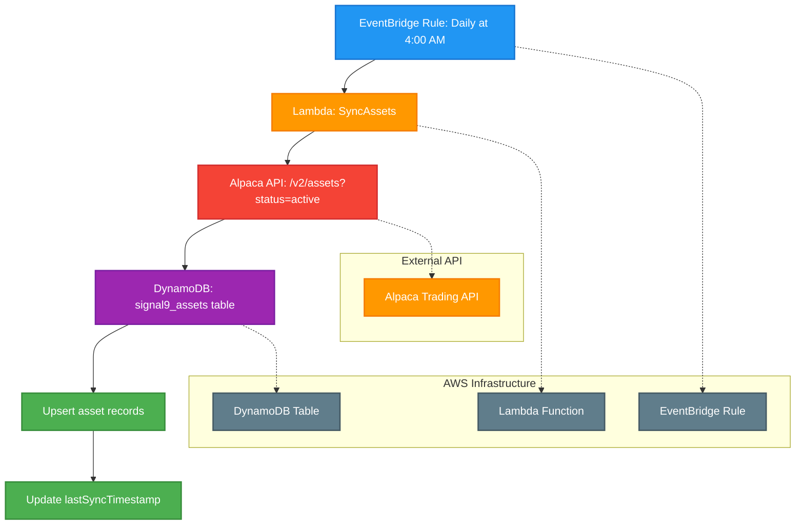

# Daily Sync Assets Cron Job

This diagram shows the daily scheduled job that synchronizes assets from the Alpaca API with the Signal9 assets table using AWS EventBridge, Lambda, and DynamoDB.

## Process Flow

1. **EventBridge Rule: Daily at 4:00 AM** - AWS EventBridge triggers the cron job daily at 4:00 AM using cron expression `0 4 * * ? *`
2. **Lambda: SyncAssets** - AWS Lambda function (Node.js/Python) is invoked to handle the asset synchronization
3. **Alpaca API: /v2/assets?status=active** - The Lambda function makes HTTPS calls to Alpaca's REST API to retrieve only active tradable assets
4. **DynamoDB: signal9_assets table** - AWS DynamoDB table that stores asset information
5. **Upsert asset records** - Database operation that inserts new assets or updates existing ones based on asset symbol
6. **Update lastSyncTimestamp** - Updates the sync timestamp to track when the last synchronization occurred

## Technical Implementation

### AWS Resources Required
- **EventBridge Rule**: Scheduled trigger with cron expression
- **Lambda Function**: Serverless compute for API calls and database operations
- **DynamoDB Table**: NoSQL database for asset storage
- **IAM Roles**: Permissions for Lambda to access DynamoDB and make external API calls

### DynamoDB Schema
See: [signal9_assets.json](../../models/dynamodb/signal9_assets.json)

The table uses a single primary key (`symbol`) with a Global Secondary Index on `status` for efficient queries by asset status.

### Error Handling
- API rate limiting and retry logic
- DynamoDB conditional writes and optimistic locking
- Dead letter queue for failed executions
- CloudWatch logging and monitoring
- SNS notifications for critical failures

## Notes

- This is a scheduled maintenance job that runs daily to keep asset data current
- The job ensures the local asset database stays synchronized with Alpaca's active asset catalog
- Running at 4:00 AM minimizes impact on trading hours
- The synchronization process uses upsert operations to handle both new and updated assets
- This maintains data consistency between the external API and internal database
- The Lambda function should implement proper error handling and logging for production use
- Only active assets are retrieved to reduce data volume and processing overhead 