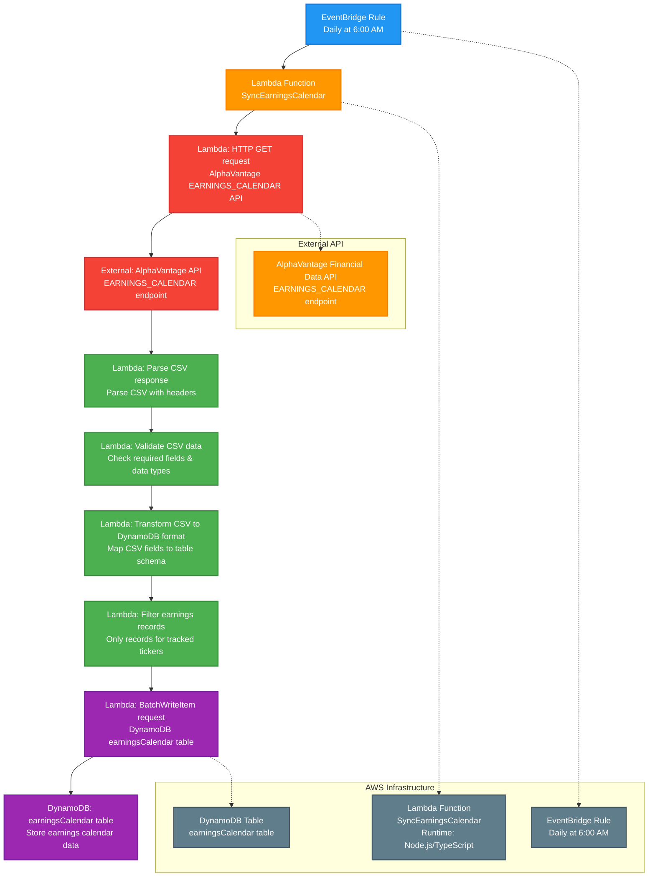

# Daily Sync Earnings Calendar Cron Job

This diagram shows the daily scheduled job that synchronizes earnings calendar data from AlphaVantage API with the Signal9 earningsCalendar table using AWS EventBridge, Lambda, and DynamoDB. The process handles CSV response format from AlphaVantage's EARNINGS_CALENDAR endpoint.

## Process Flow

1. **EventBridge Rule: Daily at 6:00 AM** - AWS EventBridge triggers the cron job daily at 6:00 AM using cron expression `0 6 * * ? *`
2. **Lambda: SyncEarningsCalendar** - AWS Lambda function (Node.js/TypeScript) is invoked to handle the earnings calendar synchronization
3. **HTTP GET request** - Makes HTTPS call to AlphaVantage's EARNINGS_CALENDAR endpoint with API key as query parameter
4. **Parse CSV response** - Parses the CSV response with headers: symbol,name,reportDate,fiscalDateEnding,estimate,currency
5. **Validate CSV data** - Validates incoming data for required fields, date formats, and data types
6. **Transform CSV to DynamoDB format** - Maps CSV fields to DynamoDB table schema
7. **Filter earnings records** - Filters to only include records for tickers tracked in our database
8. **Clear existing records** - Removes all existing earnings calendar records from DynamoDB
9. **BatchWriteItem request** - Efficiently writes new earnings calendar data to DynamoDB
10. **earningsCalendar table** - Stores current earnings calendar snapshot (complete refresh)

## Technical Implementation

### AWS Resources Required
- **EventBridge Rule**: Scheduled trigger with daily cron expression
- **Lambda Function**: Serverless compute for API calls and database operations
- **DynamoDB Table**: NoSQL database for earnings calendar storage
- **IAM Roles**: Permissions for Lambda to access DynamoDB and make external API calls
- **Secrets Manager**: Stores Signal9APICredentials secret containing all API keys

### DynamoDB Schema
See: [earningsCalendar.json](../../models/dynamodb/earningsCalendar.json)

The table uses a composite primary key with `symbol` as the partition key and `reportDate` as the sort key, with Global Secondary Indexes for efficient queries.

### CSV Processing Strategy
- **CSV Headers**: symbol,name,reportDate,fiscalDateEnding,estimate,currency
- **Data Types**: 
  - symbol: String (ticker symbol)
  - name: String (company name)
  - reportDate: String (YYYY-MM-DD format)
  - fiscalDateEnding: String (YYYY-MM-DD format)
  - estimate: Number (EPS estimate, can be null)
  - currency: String (currency code)
- **Validation**: Date format validation, numeric validation for estimates, symbol format validation
- **Filtering**: Only process records for tickers that exist in our tickers table

### Error Handling
- AlphaVantage API error responses and retry logic with exponential backoff
- CSV parsing errors and malformed data handling
- DynamoDB conditional writes and optimistic locking
- Dead letter queue for failed executions
- CloudWatch logging and monitoring
- SNS notifications for critical failures
- Data validation errors and fallback handling

### Rate Limiting Strategy
- AlphaVantage rate limits: Single daily call (very safe)
- No complex rate limiting required due to low call volume
- Simple retry logic for network failures
- Circuit breaker pattern to prevent cascading failures

### Lambda Configuration
- **Timeout**: 5 minutes (sufficient for single API call and CSV processing)
- **Memory**: 512 MB (adequate for CSV processing)
- **Environment Variables**: 
  - `SIGNAL9_API_CREDENTIALS_SECRET_NAME`: Name of the secret in AWS Secrets Manager
  - `EARNINGS_CALENDAR_TABLE_NAME`: DynamoDB table name
  - `TRACKED_TICKERS`: Comma-separated list of tickers to filter for

## Notes

- This job runs daily at 6:00 AM to ensure fresh earnings calendar data is available for the next day's earnings detection
- The process handles AlphaVantage's CSV response format, which is different from typical JSON APIs
- **Complete Refresh Strategy**: Clears all existing earnings calendar records and replaces with current data
- **CSV Processing**: Uses CSV parsing library to handle AlphaVantage's tabular data format
- **Ticker Filtering**: Only stores earnings records for tickers tracked in our system
- **Data Mapping**: Direct mapping from CSV fields to DynamoDB attributes
- The Lambda function implements proper error handling, logging, and monitoring for production use
- This maintains data consistency between the external API and internal database
- The process includes data validation to ensure quality and consistency of earnings calendar information
- **Single API Call**: Only one call per day to AlphaVantage, making rate limiting concerns minimal 