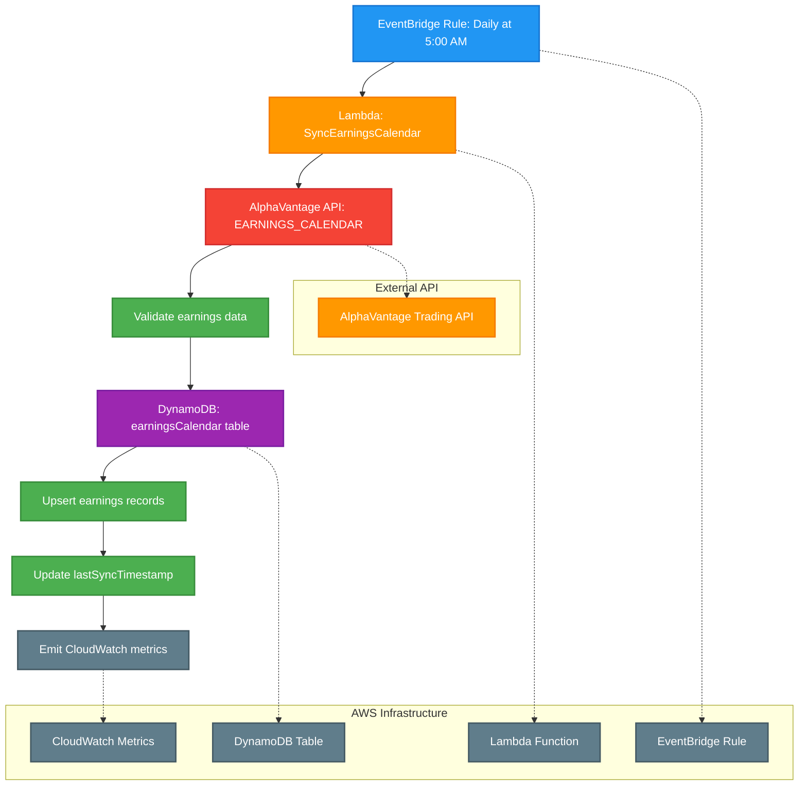

# Daily Sync Earnings Calendar Cron Job

This diagram shows the daily scheduled job that synchronizes earnings calendar data from AlphaVantage API with the Signal9 earnings calendar table using AWS EventBridge, Lambda, and DynamoDB.

## Process Flow

1. **EventBridge Rule: Daily at 5:00 AM** - AWS EventBridge triggers the cron job daily at 5:00 AM using cron expression `0 5 * * ? *`
2. **Lambda: SyncEarningsCalendar** - AWS Lambda function (Node.js/Python) is invoked to handle the earnings calendar synchronization
3. **AlphaVantage API: EARNINGS_CALENDAR** - The Lambda function makes HTTPS calls to AlphaVantage's EARNINGS_CALENDAR endpoint
4. **Validate earnings data** - Validate incoming data for required fields, date formats, and symbol matching
5. **DynamoDB: earningsCalendar table** - AWS DynamoDB table that stores earnings calendar information
6. **Upsert earnings records** - Database operation that inserts new earnings or updates existing ones based on asset symbol and earnings date
7. **Update lastSyncTimestamp** - Updates the sync timestamp to track when the last synchronization occurred
8. **Emit CloudWatch metrics** - Sends success/failure metrics and processing statistics to CloudWatch

## Technical Implementation

### AWS Resources Required
- **EventBridge Rule**: Scheduled trigger with cron expression `0 5 * * ? *`
- **Lambda Function**: Serverless compute for API calls and database operations
- **DynamoDB Table**: NoSQL database for earnings calendar storage
- **IAM Roles**: Permissions for Lambda to access DynamoDB and make external API calls
- **CloudWatch**: Monitoring and metrics collection

### DynamoDB Schema
See: [earningsCalendar.json](../../models/dynamodb/earningsCalendar.json)

The table uses a composite primary key (`asset_symbol` + `earnings_date`) with a Global Secondary Index for efficient upcoming earnings queries by date and report time.

### Data Validation Rules
- **Symbol Format**: Valid stock symbol format (e.g., AAPL, MSFT)
- **Date Format**: Valid date format (YYYY-MM-DD) and logical earnings dates
- **Report Time**: Must be "bmo" (before market open) or "amc" (after market close)
- **EPS Values**: Numeric values for estimated and actual EPS
- **Symbol Matching**: Earnings symbols must exist in assets table
- **Data Completeness**: Required fields present and non-null

### Error Handling
- **API Rate Limiting**: Implement exponential backoff for AlphaVantage API calls
- **Data Validation**: Skip invalid records and log warnings
- **DynamoDB Conditional Writes**: Use optimistic locking for concurrent updates
- **Dead Letter Queue**: Handle permanently failed executions
- **CloudWatch Logging**: Structured logging with correlation IDs
- **SNS Notifications**: Alert on high validation failure rates

### CloudWatch Metrics
- `EarningsCalendarSyncSuccess` / `EarningsCalendarSyncFailure` (Count)
- `EarningsRecordsProcessed` / `EarningsRecordsFailed` (Count)
- `AlphaVantageAPILatency` (Histogram)
- `ValidationFailureRate` (Percentage)
- `ProcessingTime` (Histogram)

## Notes

- This is a scheduled maintenance job that runs daily to keep earnings calendar data current
- The job ensures the local earnings calendar database stays synchronized with AlphaVantage's data
- Running at 5:00 AM follows the asset sync job (4:00 AM) and minimizes impact on trading hours
- The synchronization process uses upsert operations to handle both new and updated earnings records
- This maintains data consistency between the external API and internal database for earnings events
- The Lambda function implements proper error handling, validation, and monitoring for production use
- The GSI enables efficient queries for upcoming earnings by date and report time 