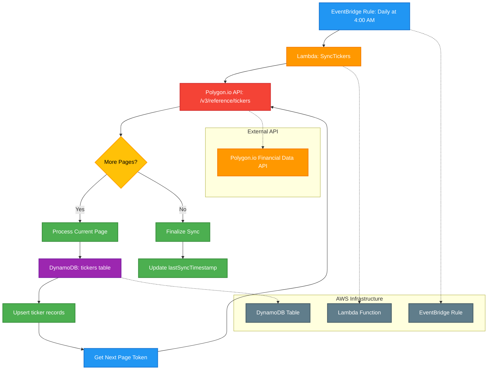

# Daily Sync Tickers Cron Job

This diagram shows the daily scheduled job that synchronizes tickers from the Polygon.io API with the Signal9 tickers table using AWS EventBridge, Lambda, and DynamoDB. The process handles paginated responses from Polygon.io to retrieve all available tickers.

## Process Flow

1. **EventBridge Rule: Daily at 4:00 AM** - AWS EventBridge triggers the cron job daily at 4:00 AM using cron expression `0 4 * * ? *`
2. **Lambda: SyncTickers** - AWS Lambda function (Node.js/TypeScript) is invoked to handle the ticker synchronization
3. **Polygon.io API: /v3/reference/tickers** - The Lambda function makes HTTPS calls to Polygon.io's REST API to retrieve all available tickers
4. **Pagination Handling** - The process iterates through all pages of results using the `next_url` parameter from Polygon.io's response
5. **Batch Processing** - Each page of tickers is processed and upserted into DynamoDB in batches
6. **DynamoDB: tickers table** - AWS DynamoDB table that stores ticker information
7. **Upsert ticker records** - Database operation that inserts new tickers or updates existing ones based on ticker symbol
8. **Update lastSyncTimestamp** - Updates the sync timestamp to track when the last synchronization occurred

## Technical Implementation

### AWS Resources Required
- **EventBridge Rule**: Scheduled trigger with cron expression
- **Lambda Function**: Serverless compute for API calls and database operations
- **DynamoDB Table**: NoSQL database for ticker storage
- **IAM Roles**: Permissions for Lambda to access DynamoDB and make external API calls
- **Secrets Manager**: Stores Polygon.io API credentials

### DynamoDB Schema
See: [tickers.json](../../models/dynamodb/tickers.json)

The table uses a single primary key (`symbol`) with Global Secondary Indexes on `type` and `market` for efficient queries by ticker type and market.

### Pagination Strategy
- **Initial Request**: `/v3/reference/tickers?limit=1000` (maximum allowed per page)
- **Next Page**: Use `next_url` from response to get subsequent pages
- **Termination**: Continue until `next_url` is null or empty
- **Rate Limiting**: Respect 25 calls per minute limit with exponential backoff
- **Progress Tracking**: Log current page number and total tickers processed

### Batch Processing
- **Batch Size**: Process up to 1000 tickers per page (Polygon.io's maximum)
- **DynamoDB Batch Operations**: Use `BatchWriteItem` for efficient bulk upserts
- **Error Handling**: Individual batch failures don't stop the entire process
- **Retry Logic**: Failed batches are retried with exponential backoff

### Error Handling
- Polygon.io API rate limiting and retry logic with exponential backoff
- DynamoDB conditional writes and optimistic locking
- Dead letter queue for failed executions
- CloudWatch logging and monitoring
- SNS notifications for critical failures
- Circuit breaker pattern for API resilience
- Pagination error recovery (resume from last successful page)

### Rate Limiting Strategy
- Polygon.io rate limits: 25 calls per minute
- Implementation includes exponential backoff (1s, 2s, 4s, 8s)
- Maximum 3 retries per request
- Circuit breaker pattern to prevent cascading failures
- **Pagination Considerations**: Each page request counts against rate limit

### Lambda Configuration
- **Timeout**: 15 minutes (maximum for Lambda)
- **Memory**: 1024 MB (sufficient for batch processing)
- **Concurrency**: 1 (to avoid rate limit conflicts)
- **Environment Variables**: 
  - `POLYGON_API_KEY`: API key from Secrets Manager
  - `TICKERS_TABLE_NAME`: DynamoDB table name
  - `MAX_PAGES`: Safety limit for pagination (e.g., 1000)

## Notes

- This is a scheduled maintenance job that runs daily to keep ticker data current
- The job ensures the local ticker database stays synchronized with Polygon.io's ticker catalog
- Running at 4:00 AM minimizes impact on trading hours
- The synchronization process uses upsert operations to handle both new and updated tickers
- This maintains data consistency between the external API and internal database
- The Lambda function implements proper error handling, logging, and monitoring for production use
- All available tickers are retrieved to maintain comprehensive market coverage
- The process includes data validation to ensure quality and consistency of ticker information
- **Pagination Handling**: The process can handle large datasets by processing pages sequentially
- **Progress Monitoring**: CloudWatch logs track progress through pages and total tickers processed
- **Resilience**: If the process fails mid-sync, it can resume from the last successful page on next run 