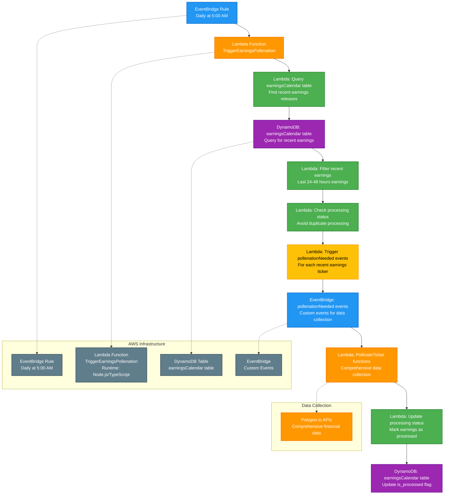

# Daily Trigger Earnings Pollination Cron Job

This diagram shows the daily scheduled job that detects recent earnings releases and triggers comprehensive data collection for those tickers. This job runs at 5:00 AM, BEFORE the earnings calendar gets refreshed at 6:00 AM, to ensure we don't miss any earnings that might be overwritten by the calendar refresh.

## Process Flow

1. **EventBridge Rule: Daily at 5:00 AM** - AWS EventBridge triggers the cron job daily at 5:00 AM using cron expression `0 5 * * ? *`
2. **Lambda: TriggerEarningsPollenation** - AWS Lambda function (Node.js/TypeScript) is invoked to handle earnings detection
3. **Query earningsCalendar table** - Queries DynamoDB for recent earnings releases (last 24-48 hours)
4. **Filter recent earnings** - Filters earnings to only include recent releases that haven't been processed
5. **Check processing status** - Ensures we don't process the same earnings multiple times
6. **Trigger pollenationNeeded events** - Creates custom EventBridge events for each ticker with recent earnings
7. **PollinateTicker functions** - Lambda functions triggered by events to collect comprehensive financial data
8. **Update processing status** - Marks earnings as processed to prevent duplicate processing
9. **Update is_processed flag** - Updates the earningsCalendar table to track processing status

## Technical Implementation

### AWS Resources Required
- **EventBridge Rule**: Scheduled trigger with daily cron expression
- **Lambda Function**: Serverless compute for earnings detection and event triggering
- **DynamoDB Table**: NoSQL database for earnings calendar queries
- **IAM Roles**: Permissions for Lambda to access DynamoDB and trigger EventBridge events
- **Custom Events**: EventBridge custom events for pollenationNeeded triggers

### DynamoDB Query Strategy
- **Query Pattern**: Query earningsCalendar table by date range (last 24-48 hours)
- **Filtering**: Only process earnings where `is_processed = false`
- **Date Range**: Look for earnings with `reportDate` in recent past
- **Batch Processing**: Process multiple earnings releases efficiently

### Earnings Detection Logic
- **Time Window**: Detect earnings from last 24-48 hours
- **Processing Status**: Only process unprocessed earnings (`is_processed = false`)
- **Duplicate Prevention**: Mark earnings as processed immediately after triggering events
- **Error Handling**: Handle cases where earnings data is incomplete or invalid

### Event Triggering Strategy
- **Custom Events**: Create `pollenationNeeded` events for each ticker with recent earnings
- **Event Payload**: Include ticker symbol and earnings context
- **Batch Events**: Efficiently trigger multiple events for multiple earnings
- **Event Routing**: Events trigger PollinateTicker Lambda functions

### Error Handling
- **Query Failures**: Handle DynamoDB query errors and retry logic
- **Event Triggering**: Handle EventBridge event creation failures
- **Processing Status**: Ensure processing status is updated even if events fail
- **Dead Letter Queue**: Handle permanently failed executions
- **CloudWatch Logging**: Structured logging with correlation IDs
- **SNS Notifications**: Alert on high failure rates

### Rate Limiting Strategy
- **Event Throttling**: Limit number of events triggered simultaneously
- **API Rate Limits**: Respect Polygon.io rate limits for triggered data collection
- **Batch Processing**: Process earnings in batches to avoid overwhelming the system

### Lambda Configuration
- **Timeout**: 5 minutes (sufficient for earnings detection and event triggering)
- **Memory**: 512 MB (adequate for database queries and event processing)
- **Environment Variables**: 
  - `SIGNAL9_API_CREDENTIALS_SECRET_NAME`: Name of the secret in AWS Secrets Manager
  - `EARNINGS_CALENDAR_TABLE_NAME`: DynamoDB table name
  - `EVENT_BUS_NAME`: EventBridge custom event bus name
  - `DETECTION_WINDOW_HOURS`: Hours to look back for earnings (e.g., 48)

## Notes

- This job runs daily at 5:00 AM, BEFORE the earnings calendar refresh at 6:00 AM
- **Critical Timing**: Ensures earnings detection happens before calendar gets overwritten
- **Earnings Detection**: Identifies recent earnings releases from the current calendar
- **Event-Driven Processing**: Triggers comprehensive data collection for earnings-triggered tickers
- **Duplicate Prevention**: Marks earnings as processed to avoid duplicate data collection
- The Lambda function implements proper error handling, logging, and monitoring for production use
- This maintains data consistency and ensures no earnings are missed due to calendar refresh timing
- The process includes data validation to ensure quality and consistency of earnings detection
- **Processing Status**: Tracks which earnings have been processed to prevent duplicates 