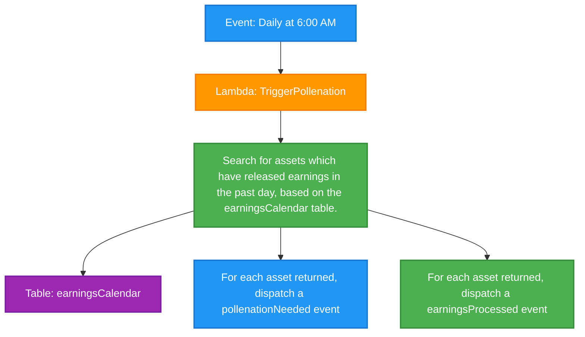

# Daily Trigger Earnings Pollenation Cron Job

This diagram shows the daily scheduled job that triggers data collection and processing for assets that have released earnings in the past day.

## Process Flow

1. **Event: Daily at 6:00 AM** - A scheduled cron job triggers daily at 6:00 AM
2. **Lambda: TriggerPollenation** - A Lambda function is invoked to handle the earnings processing trigger
3. **Search earnings calendar** - The function queries the earningsCalendar table to find assets that released earnings in the past day
4. **Table: earningsCalendar** - The database table that contains earnings release information
5. **Dispatch pollenationNeeded events** - For each qualifying asset, trigger data collection events
6. **Dispatch earningsProcessed events** - For each qualifying asset, trigger earnings processing events

## Notes

- This is a scheduled job that runs daily to process earnings that were released the previous day
- The job acts as a coordinator, triggering both data collection and processing workflows
- Running at 6:00 AM follows the earnings calendar sync job (5:00 AM) and asset sync job (4:00 AM)
- The process ensures that all earnings data is collected and processed systematically
- Two types of events are dispatched for each asset to handle different aspects of earnings processing 