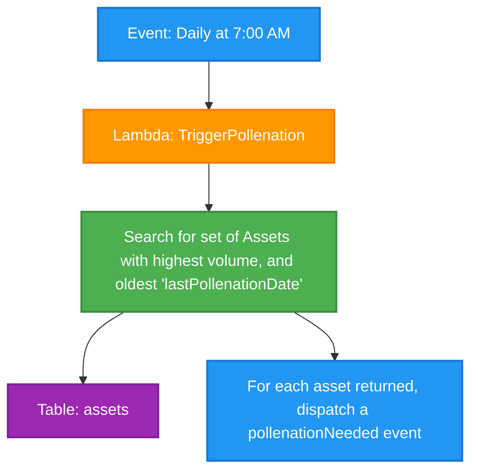

# Daily Trigger Pollenation Cron Job

This diagram shows the daily scheduled job that triggers data collection for high-volume assets that need their data refreshed based on age.

## Process Flow

1. **Event: Daily at 7:00 AM** - A scheduled cron job triggers daily at 7:00 AM
2. **Lambda: TriggerPollenation** - A Lambda function is invoked to handle the data collection trigger
3. **Search for high-volume assets** - The function queries the assets table to find assets with:
   - Highest trading volume
   - Oldest 'lastPollenationDate' (indicating they need data refresh)
4. **Table: assets** - The database table that contains asset information including volume and last pollenation date
5. **Dispatch pollenationNeeded events** - For each qualifying asset, trigger data collection events

## Notes

- This is a scheduled job that runs daily to refresh data for assets that need updating
- The job prioritizes high-volume assets that haven't been updated recently
- Running at 7:00 AM follows the earnings processing job (6:00 AM) and other sync jobs
- The process ensures that the most important and outdated asset data gets refreshed regularly
- This maintains data freshness for high-priority assets based on trading activity and update frequency 