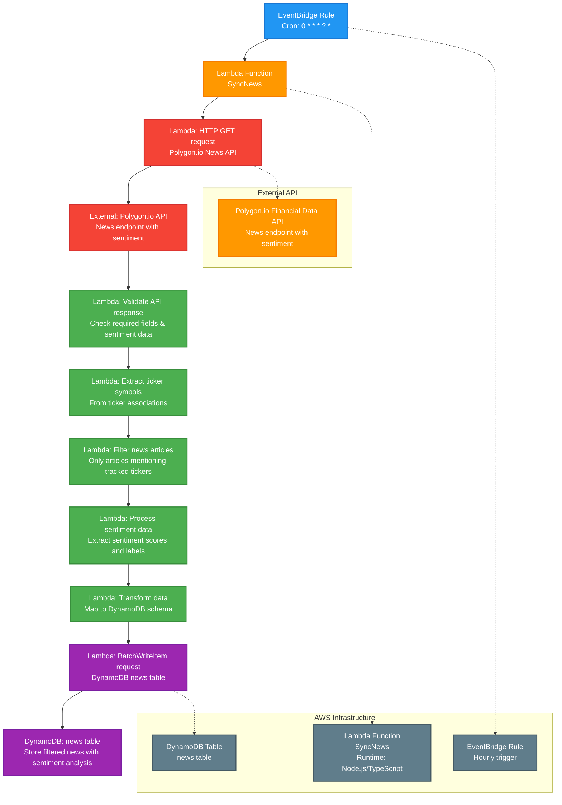

# Hourly Sync News Cron Job

This diagram shows the hourly scheduled job that synchronizes news data with sentiment analysis from Polygon.io API, collecting all news and linking it to relevant tickers for comprehensive market analysis.

## Process Flow

1. **EventBridge Rule: Hourly** - AWS EventBridge triggers the cron job every hour using cron expression `0 * * * ? *`
2. **Lambda: SyncNews** - AWS Lambda function (Node.js/TypeScript) is invoked to handle the news synchronization
3. **HTTP GET request** - Makes HTTPS call to Polygon.io's News endpoint with sentiment analysis
4. **Validate API response** - Validates incoming data for required fields, sentiment scores, and relevance
5. **Extract ticker symbols** - Extracts unique ticker symbols from the news articles
6. **Filter news articles** - Filters to only include articles mentioning tracked tickers from our database
7. **Process sentiment data** - Extracts and validates sentiment scores and labels from Polygon.io
8. **Transform data** - Maps Polygon.io response to our DynamoDB schema
9. **BatchWriteItem request** - Efficiently writes filtered news data to DynamoDB
10. **news table** - Stores filtered news with sentiment analysis and ticker associations

## Technical Implementation

### AWS Resources Required
- **EventBridge Rule**: Scheduled trigger with hourly cron expression
- **Lambda Function**: Serverless compute for API calls and database operations
- **DynamoDB Table**: NoSQL database for news storage
- **IAM Roles**: Permissions for Lambda to access DynamoDB and make external API calls
- **Secrets Manager**: Stores Polygon.io API credentials

### DynamoDB Schema
See: [news.json](../../models/dynamodb/news.json)

The table uses a composite primary key with `news_id` as the partition key and `time_published` as the sort key, with Global Secondary Indexes for efficient queries.

### Error Handling
- Polygon.io API rate limiting and retry logic with exponential backoff
- DynamoDB conditional writes and optimistic locking
- Dead letter queue for failed executions
- CloudWatch logging and monitoring
- SNS notifications for critical failures
- Sentiment data validation and fallback handling

### Rate Limiting Strategy
- Polygon.io rate limits: 25 calls per minute
- Implementation includes exponential backoff (1s, 2s, 4s, 8s)
- Maximum 3 retries per request
- Circuit breaker pattern to prevent cascading failures

### Lambda Configuration
- **Timeout**: 5 minutes (sufficient for hourly news sync)
- **Memory**: 512 MB (adequate for news processing)
- **Environment Variables**: 
  - `POLYGON_API_KEY`: API key from Secrets Manager
  - `NEWS_TABLE_NAME`: DynamoDB table name
  - `TRACKED_TICKERS`: Comma-separated list of tickers to filter for

## Notes

- This job runs hourly to ensure fresh news data is available for market analysis
- The process includes sentiment analysis provided by Polygon.io, eliminating the need for separate sentiment processing
- **API-Driven Sentiment**: Uses Polygon.io's built-in sentiment analysis for accurate market sentiment scoring
- **Ticker Filtering**: Only stores news articles that mention tracked tickers to maintain relevance
- **Sentiment Integration**: Sentiment scores and labels are directly available from Polygon.io's API response
- The Lambda function implements proper error handling, logging, and monitoring for production use
- This maintains data consistency between the external API and internal database
- The process includes data validation to ensure quality and consistency of news and sentiment information 