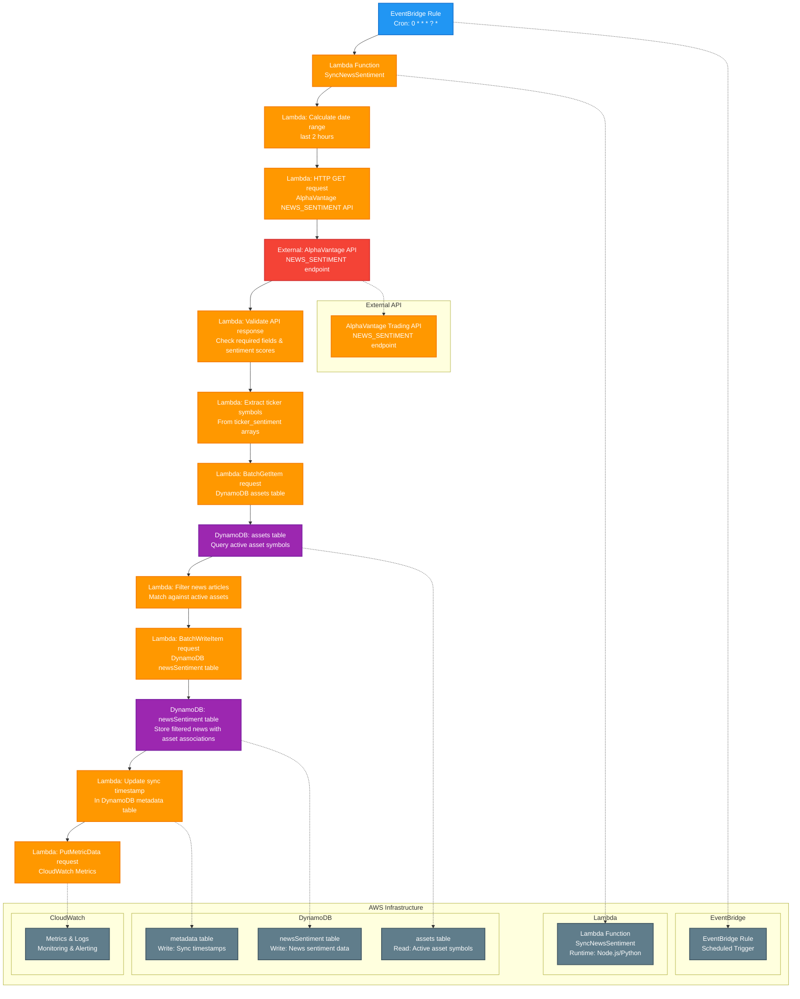

# Hourly Sync News Sentiment Cron Job

This diagram shows the hourly scheduled job that synchronizes news sentiment data from AlphaVantage API, collecting all news and linking it to relevant assets for comprehensive market analysis.

## Process Flow

### AWS Resource Responsibilities

1. **EventBridge Rule** - AWS EventBridge triggers the job every hour using cron expression `0 * * * ? *`
2. **Lambda Function** - AWS Lambda function (Node.js/Python) performs all processing logic:
   - **Calculate date range** - Determines the time window for news collection (e.g., last 2 hours)
   - **HTTP GET request** - Makes HTTPS call to AlphaVantage's NEWS_SENTIMENT endpoint
   - **Validate API response** - Validates incoming data for required fields, sentiment scores, and relevance
   - **Extract ticker symbols** - Extracts unique ticker symbols from the `ticker_sentiment` arrays
   - **BatchGetItem request** - Queries DynamoDB to check which extracted tickers exist in active assets
   - **Filter news articles** - Filters news to only those mentioning tracked assets
   - **BatchWriteItem request** - Writes filtered news to DynamoDB with asset associations
   - **Update sync timestamp** - Updates the sync timestamp in metadata table
   - **PutMetricData request** - Sends metrics to CloudWatch

3. **DynamoDB Tables**:
   - **assets table** - Source of active asset symbols (read operation)
   - **newsSentiment table** - Stores filtered news sentiment information (write operation)
   - **metadata table** - Tracks sync timestamps and job state (write operation)

4. **CloudWatch** - Receives metrics and logs for monitoring and alerting

5. **AlphaVantage API** - External service providing news sentiment data via HTTP endpoint

## Technical Implementation

### AWS Resources Required
- **EventBridge Rule**: Scheduled trigger with cron expression `0 * * * ? *` (every hour)
- **Lambda Function**: Serverless compute for API calls and database operations
- **DynamoDB Tables**: 
  - assets (read access)
  - newsSentiment (write access) 
  - metadata (write access for sync timestamps)
- **IAM Roles**: Permissions for Lambda to access DynamoDB, CloudWatch, and make external API calls
- **CloudWatch**: Monitoring, metrics collection, and logging

### Rate Limiting Strategy
- **AlphaVantage Free Tier**: 5 API calls per minute, 500 per day
- **Single API Call**: One call per hour to get all news in date range
- **Exponential Backoff**: Implement retry logic with exponential backoff
- **Date Range Optimization**: Use 2-hour windows to minimize data overlap
- **Efficient Filtering**: Only process news mentioning our tracked assets, reducing storage and processing costs

### Error Handling
- **API Rate Limiting**: Implement exponential backoff for AlphaVantage API calls
- **Data Validation**: Skip invalid records and log warnings
- **DynamoDB Conditional Writes**: Use optimistic locking for concurrent updates
- **Dead Letter Queue**: Handle permanently failed executions
- **CloudWatch Logging**: Structured logging with correlation IDs
- **SNS Notifications**: Alert on high validation failure rates

### CloudWatch Metrics
- `NewsSentimentSyncSuccess` / `NewsSentimentSyncFailure` (Count)
- `NewsRecordsProcessed` / `NewsRecordsFailed` (Count)
- `NewsRecordsFiltered` (Count) - Number of news articles filtered out (not mentioning tracked assets)
- `AlphaVantageAPILatency` (Histogram)
- `ValidationFailureRate` (Percentage)
- `ProcessingTime` (Histogram)
- `NewsArticlesPerHour` (Gauge)
- `AssetMatchesFound` (Count)
- `UniqueTickersFound` (Count) - Number of unique tickers found in API response
- `ActiveAssetsMatched` (Count) - Number of tickers that matched our active assets

## Notes

- This job runs hourly to ensure fresh news sentiment data is available for AI analysis
- Single API call per hour collects all news within a 2-hour window
- **Efficient Filtering**: Only news mentioning tracked assets is stored, reducing storage costs and processing overhead
- **API-Driven Matching**: Uses AlphaVantage's `ticker_sentiment` arrays for precise asset matching (no content parsing needed)
- **Batch Database Queries**: Efficiently validates tickers against active assets using batch operations
- Rate limiting is minimal since only one API call is made per hour
- **Focused Data Storage**: Only relevant news is stored, improving query performance and reducing costs
- Date range windows prevent duplicate news collection while ensuring coverage
- **Performance Optimization**: Eliminates the need to query all assets or parse news content manually 