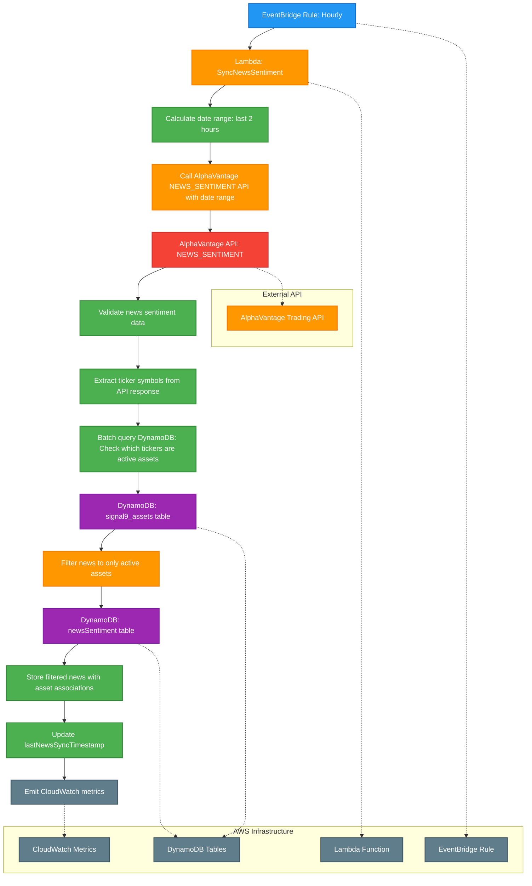

# Hourly Sync News Sentiment Cron Job

This diagram shows the hourly scheduled job that synchronizes news sentiment data from AlphaVantage API, collecting all news and linking it to relevant assets for comprehensive market analysis.

## Process Flow

1. **EventBridge Rule: Hourly** - AWS EventBridge triggers the job every hour using cron expression `0 * * * ? *`
2. **Lambda: SyncNewsSentiment** - AWS Lambda function (Node.js/Python) is invoked to handle news sentiment synchronization
3. **Calculate date range: last 2 hours** - Determine the time window for news collection (e.g., last 2 hours)
4. **Call AlphaVantage NEWS_SENTIMENT API with date range** - Single API call to get all news within the time window
5. **AlphaVantage API: NEWS_SENTIMENT** - The Lambda function makes a single HTTPS call to AlphaVantage's NEWS_SENTIMENT endpoint
6. **Validate news sentiment data** - Validate incoming data for required fields, sentiment scores, and relevance
7. **Extract ticker symbols from API response** - Extract unique ticker symbols from the `ticker_sentiment` arrays in the API response
8. **Batch query DynamoDB: Check which tickers are active assets** - Efficiently check which extracted tickers exist in our active assets table
9. **DynamoDB: signal9_assets table** - Source of active asset symbols for validation
10. **Filter news to only active assets** - Filter news articles to only those mentioning our tracked assets
11. **DynamoDB: newsSentiment table** - AWS DynamoDB table that stores filtered news sentiment information
12. **Store filtered news with asset associations** - Store only relevant news items, linking them to active assets
13. **Update lastNewsSyncTimestamp** - Updates the sync timestamp to track when news was last collected
14. **Emit CloudWatch metrics** - Sends success/failure metrics and processing statistics to CloudWatch

## Technical Implementation

### AWS Resources Required
- **EventBridge Rule**: Scheduled trigger with cron expression `0 * * * ? *` (every hour)
- **Lambda Function**: Serverless compute for API calls and database operations
- **DynamoDB Tables**: signal9_assets (read) and newsSentiment (write)
- **IAM Roles**: Permissions for Lambda to access DynamoDB and make external API calls
- **CloudWatch**: Monitoring and metrics collection

### Rate Limiting Strategy
- **AlphaVantage Free Tier**: 5 API calls per minute, 500 per day
- **Single API Call**: One call per hour to get all news in date range
- **Exponential Backoff**: Implement retry logic with exponential backoff
- **Date Range Optimization**: Use 2-hour windows to minimize data overlap
- **Efficient Filtering**: Only process news mentioning our tracked assets, reducing storage and processing costs

### Error Handling
- **API Rate Limiting**: Implement exponential backoff for AlphaVantage API calls
- **Data Validation**: Skip invalid records and log warnings
- **DynamoDB Conditional Writes**: Use optimistic locking for concurrent updates
- **Dead Letter Queue**: Handle permanently failed executions
- **CloudWatch Logging**: Structured logging with correlation IDs
- **SNS Notifications**: Alert on high validation failure rates

### CloudWatch Metrics
- `NewsSentimentSyncSuccess` / `NewsSentimentSyncFailure` (Count)
- `NewsRecordsProcessed` / `NewsRecordsFailed` (Count)
- `NewsRecordsFiltered` (Count) - Number of news articles filtered out (not mentioning tracked assets)
- `AlphaVantageAPILatency` (Histogram)
- `ValidationFailureRate` (Percentage)
- `ProcessingTime` (Histogram)
- `NewsArticlesPerHour` (Gauge)
- `AssetMatchesFound` (Count)
- `UniqueTickersFound` (Count) - Number of unique tickers found in API response
- `ActiveAssetsMatched` (Count) - Number of tickers that matched our active assets

## Notes

- This job runs hourly to ensure fresh news sentiment data is available for AI analysis
- Single API call per hour collects all news within a 2-hour window
- **Efficient Filtering**: Only news mentioning tracked assets is stored, reducing storage costs and processing overhead
- **API-Driven Matching**: Uses AlphaVantage's `ticker_sentiment` arrays for precise asset matching (no content parsing needed)
- **Batch Database Queries**: Efficiently validates tickers against active assets using batch operations
- Rate limiting is minimal since only one API call is made per hour
- **Focused Data Storage**: Only relevant news is stored, improving query performance and reducing costs
- Date range windows prevent duplicate news collection while ensuring coverage
- **Performance Optimization**: Eliminates the need to query all assets or parse news content manually 