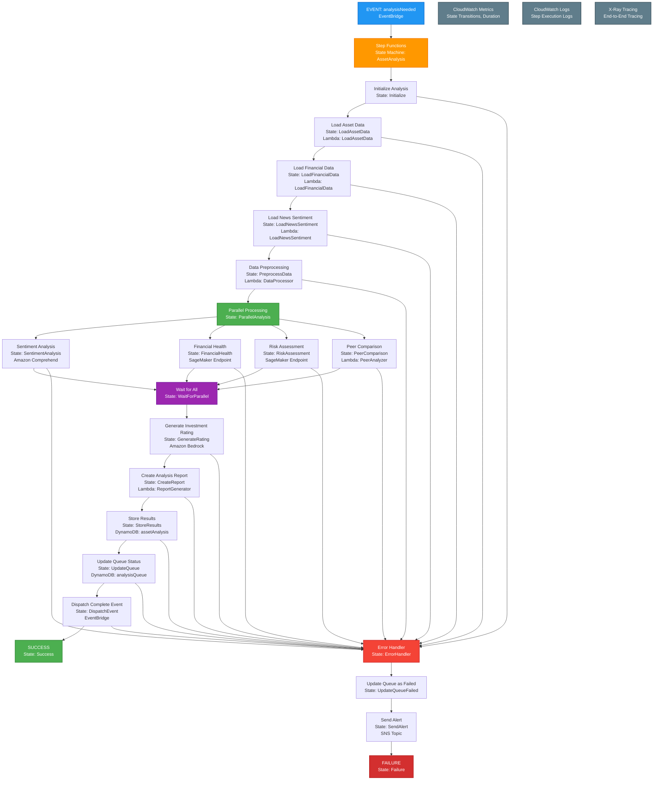

# Analysis Needed Event Handler - Step Functions State Machine

This diagram shows the AWS Step Functions state machine for handling the `analysisNeeded` event in the Signal9 Advisor system, providing robust workflow orchestration with built-in error handling and monitoring.



## Step Functions State Machine Architecture

### **State Machine Definition (ASL - Amazon States Language)**

```json
{
  "Comment": "Asset Analysis State Machine",
  "StartAt": "Initialize",
  "States": {
    "Initialize": {
      "Type": "Pass",
      "Result": {
        "asset_symbol": "$.detail.asset_symbol",
        "analysis_id": "$.id",
        "timestamp": "$$.State.EnteredTime"
      },
      "Next": "LoadAssetData"
    },
    "LoadAssetData": {
      "Type": "Task",
      "Resource": "arn:aws:lambda:${region}:${account}:function:LoadAssetData",
      "Retry": [
        {
          "ErrorEquals": ["Lambda.ServiceException", "Lambda.AWSLambdaException"],
          "IntervalSeconds": 2,
          "MaxAttempts": 3,
          "BackoffRate": 2.0
        }
      ],
      "Catch": [
        {
          "ErrorEquals": ["States.ALL"],
          "Next": "ErrorHandler"
        }
      ],
      "Next": "LoadFinancialData"
    },
    "LoadFinancialData": {
      "Type": "Task",
      "Resource": "arn:aws:lambda:${region}:${account}:function:LoadFinancialData",
      "Retry": [
        {
          "ErrorEquals": ["Lambda.ServiceException"],
          "IntervalSeconds": 2,
          "MaxAttempts": 3
        }
      ],
      "Catch": [
        {
          "ErrorEquals": ["States.ALL"],
          "Next": "ErrorHandler"
        }
      ],
      "Next": "LoadNewsSentiment"
    },
    "LoadNewsSentiment": {
      "Type": "Task",
      "Resource": "arn:aws:lambda:${region}:${account}:function:LoadNewsSentiment",
      "Retry": [
        {
          "ErrorEquals": ["Lambda.ServiceException"],
          "IntervalSeconds": 2,
          "MaxAttempts": 3
        }
      ],
      "Catch": [
        {
          "ErrorEquals": ["States.ALL"],
          "Next": "ErrorHandler"
        }
      ],
      "Next": "PreprocessData"
    },
    "PreprocessData": {
      "Type": "Task",
      "Resource": "arn:aws:lambda:${region}:${account}:function:DataProcessor",
      "Retry": [
        {
          "ErrorEquals": ["Lambda.ServiceException"],
          "IntervalSeconds": 2,
          "MaxAttempts": 3
        }
      ],
      "Catch": [
        {
          "ErrorEquals": ["States.ALL"],
          "Next": "ErrorHandler"
        }
      ],
      "Next": "ParallelAnalysis"
    },
    "ParallelAnalysis": {
      "Type": "Parallel",
      "Branches": [
        {
          "StartAt": "SentimentAnalysis",
          "States": {
            "SentimentAnalysis": {
              "Type": "Task",
              "Resource": "arn:aws:comprehend:${region}:${account}:batch-detection-job",
              "Parameters": {
                "InputDataConfig": {
                  "S3Uri": "$.news_data_s3_uri",
                  "InputFormat": "ONE_DOC_PER_FILE"
                },
                "OutputDataConfig": {
                  "S3Uri": "$.sentiment_output_s3_uri"
                },
                "DataAccessRoleArn": "arn:aws:iam::${account}:role/ComprehendDataAccessRole",
                "JobName": "$.analysis_id-sentiment"
              },
              "Next": "SentimentComplete"
            },
            "SentimentComplete": {
              "Type": "Pass",
              "End": true
            }
          }
        },
        {
          "StartAt": "FinancialHealth",
          "States": {
            "FinancialHealth": {
              "Type": "Task",
              "Resource": "arn:aws:sagemaker:${region}:${account}:endpoint/${financial_health_endpoint}/invocations",
              "Parameters": {
                "Body": "$.financial_data",
                "ContentType": "application/json"
              },
              "Next": "FinancialHealthComplete"
            },
            "FinancialHealthComplete": {
              "Type": "Pass",
              "End": true
            }
          }
        },
        {
          "StartAt": "RiskAssessment",
          "States": {
            "RiskAssessment": {
              "Type": "Task",
              "Resource": "arn:aws:sagemaker:${region}:${account}:endpoint/${risk_assessment_endpoint}/invocations",
              "Parameters": {
                "Body": "$.financial_data",
                "ContentType": "application/json"
              },
              "Next": "RiskAssessmentComplete"
            },
            "RiskAssessmentComplete": {
              "Type": "Pass",
              "End": true
            }
          }
        },
        {
          "StartAt": "PeerComparison",
          "States": {
            "PeerComparison": {
              "Type": "Task",
              "Resource": "arn:aws:lambda:${region}:${account}:function:PeerAnalyzer",
              "Next": "PeerComparisonComplete"
            },
            "PeerComparisonComplete": {
              "Type": "Pass",
              "End": true
            }
          }
        }
      ],
      "Catch": [
        {
          "ErrorEquals": ["States.ALL"],
          "Next": "ErrorHandler"
        }
      ],
      "Next": "WaitForParallel"
    },
    "WaitForParallel": {
      "Type": "Pass",
      "Next": "GenerateRating"
    },
    "GenerateRating": {
      "Type": "Task",
      "Resource": "arn:aws:bedrock:${region}:${account}:invoke-model",
      "Parameters": {
        "ModelId": "anthropic.claude-3-sonnet-20240229-v1:0",
        "Body": {
          "prompt": "$.analysis_prompt",
          "max_tokens": 4000,
          "temperature": 0.1
        }
      },
      "Retry": [
        {
          "ErrorEquals": ["Bedrock.ThrottlingException"],
          "IntervalSeconds": 5,
          "MaxAttempts": 3,
          "BackoffRate": 2.0
        }
      ],
      "Catch": [
        {
          "ErrorEquals": ["States.ALL"],
          "Next": "ErrorHandler"
        }
      ],
      "Next": "CreateReport"
    },
    "CreateReport": {
      "Type": "Task",
      "Resource": "arn:aws:lambda:${region}:${account}:function:ReportGenerator",
      "Retry": [
        {
          "ErrorEquals": ["Lambda.ServiceException"],
          "IntervalSeconds": 2,
          "MaxAttempts": 3
        }
      ],
      "Catch": [
        {
          "ErrorEquals": ["States.ALL"],
          "Next": "ErrorHandler"
        }
      ],
      "Next": "StoreResults"
    },
    "StoreResults": {
      "Type": "Task",
      "Resource": "arn:aws:dynamodb:${region}:${account}:table/assetAnalysis",
      "Parameters": {
        "Item": {
          "symbol": "$.asset_symbol",
          "analysis_date": "$.timestamp",
          "analysis_data": "$.analysis_results"
        }
      },
      "Retry": [
        {
          "ErrorEquals": ["DynamoDB.ProvisionedThroughputExceededException"],
          "IntervalSeconds": 1,
          "MaxAttempts": 3
        }
      ],
      "Catch": [
        {
          "ErrorEquals": ["States.ALL"],
          "Next": "ErrorHandler"
        }
      ],
      "Next": "UpdateQueue"
    },
    "UpdateQueue": {
      "Type": "Task",
      "Resource": "arn:aws:dynamodb:${region}:${account}:table/analysisQueue",
      "Parameters": {
        "Key": {
          "queue_id": "$.analysis_id"
        },
        "UpdateExpression": "SET #status = :status, completed_at = :timestamp",
        "ExpressionAttributeNames": {
          "#status": "status"
        },
        "ExpressionAttributeValues": {
          ":status": "completed",
          ":timestamp": "$$.State.EnteredTime"
        }
      },
      "Next": "DispatchEvent"
    },
    "DispatchEvent": {
      "Type": "Task",
      "Resource": "arn:aws:events:${region}:${account}:event-bus/default",
      "Parameters": {
        "Entries": [
          {
            "Source": "signal9.analysis",
            "DetailType": "analysisComplete",
            "Detail": {
              "asset_symbol": "$.asset_symbol",
              "analysis_id": "$.analysis_id",
              "status": "completed"
            }
          }
        ]
      },
      "Next": "Success"
    },
    "Success": {
      "Type": "Succeed"
    },
    "ErrorHandler": {
      "Type": "Pass",
      "Next": "UpdateQueueFailed"
    },
    "UpdateQueueFailed": {
      "Type": "Task",
      "Resource": "arn:aws:dynamodb:${region}:${account}:table/analysisQueue",
      "Parameters": {
        "Key": {
          "queue_id": "$.analysis_id"
        },
        "UpdateExpression": "SET #status = :status, error_message = :error, failed_at = :timestamp",
        "ExpressionAttributeNames": {
          "#status": "status"
        },
        "ExpressionAttributeValues": {
          ":status": "failed",
          ":error": "$.error",
          ":timestamp": "$$.State.EnteredTime"
        }
      },
      "Next": "SendAlert"
    },
    "SendAlert": {
      "Type": "Task",
      "Resource": "arn:aws:sns:${region}:${account}:topic/analysis-failures",
      "Parameters": {
        "Message": {
          "analysis_id": "$.analysis_id",
          "asset_symbol": "$.asset_symbol",
          "error": "$.error",
          "timestamp": "$$.State.EnteredTime"
        }
      },
      "Next": "Failure"
    },
    "Failure": {
      "Type": "Fail",
      "Cause": "Analysis failed",
      "Error": "AnalysisError"
    }
  }
}
```

## Benefits of Step Functions Architecture

### **1. Built-in Error Handling**
- **Retry Logic**: Automatic retry with exponential backoff
- **Error Recovery**: Graceful handling of failures at any step
- **Dead Letter Queues**: Failed executions are captured for investigation
- **Error Notifications**: SNS alerts for critical failures

### **2. State Management**
- **Automatic State Tracking**: No need to manually track execution state
- **Data Passing**: Automatic data flow between states
- **State Visualization**: Built-in execution history and visualization
- **State Persistence**: Execution state is persisted automatically

### **3. Parallel Processing**
- **Concurrent Execution**: Multiple analysis steps run in parallel
- **Resource Optimization**: Better utilization of AWS resources
- **Faster Execution**: Reduced total processing time
- **Independent Scaling**: Each parallel branch can scale independently

### **4. Monitoring & Observability**
- **Execution History**: Complete audit trail of all state transitions
- **Performance Metrics**: Built-in CloudWatch integration
- **Visual Debugging**: Step-by-step execution visualization
- **Error Tracking**: Detailed error information and stack traces

### **5. Cost Efficiency**
- **Pay-per-transition**: Only pay for state transitions, not idle time
- **Resource Optimization**: Better resource utilization
- **Reduced Lambda Costs**: Shorter Lambda execution times
- **Built-in Caching**: Automatic caching of frequently accessed data

### **6. Scalability**
- **High Concurrency**: Can handle thousands of concurrent executions
- **Auto-scaling**: Automatic scaling based on demand
- **Resource Limits**: Configurable limits to prevent runaway costs
- **Distributed Processing**: Can distribute across multiple regions

## Implementation Considerations

### **State Machine Configuration**
- **Execution Timeout**: 15 minutes (configurable)
- **History Retention**: 90 days (for audit purposes)
- **Logging Level**: ALL (for comprehensive monitoring)
- **Tracing**: X-Ray integration enabled

### **Lambda Function Design**
- **Stateless**: Each Lambda function is stateless
- **Input/Output**: Clear input/output contracts
- **Error Handling**: Proper error codes and messages
- **Resource Optimization**: Appropriate memory and timeout settings

### **Data Flow Management**
- **ResultPath**: Used to manage data flow between states
- **InputPath**: Used to filter input data for each state
- **OutputPath**: Used to filter output data from each state
- **Parameters**: Used to transform data between states

This Step Functions architecture provides a robust, scalable, and maintainable solution for the asset analysis workflow, with built-in error handling, monitoring, and cost optimization features. 