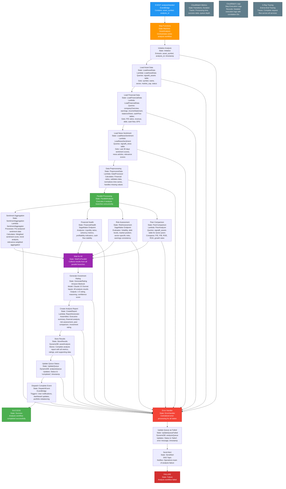

# Analysis Needed Event Handler - Step Functions State Machine

This diagram shows the AWS Step Functions state machine for handling the `analysisNeeded` event in the Signal9 Advisor system, providing robust workflow orchestration with built-in error handling and monitoring.

## Detailed Component Descriptions

### **Data Loading Lambda Functions**

#### **LoadAssetData Lambda**
- **Purpose**: Retrieves basic asset information and metadata
- **Queries**: `signal9_assets` table
- **Key Data Retrieved**:
  - `symbol`: Stock ticker symbol (e.g., AAPL, MSFT)
  - `name`: Company name
  - `sector`: Industry sector classification
  - `market_cap`: Market capitalization
  - `status`: Active/inactive trading status
  - `tradable`: Whether asset can be traded
  - `marginable`: Whether asset can be margined
- **Use Case**: Provides context for analysis and peer comparison

#### **LoadFinancialData Lambda**
- **Purpose**: Retrieves comprehensive financial data from multiple tables
- **Queries**: Multiple DynamoDB tables in parallel
- **Data Sources**:
  - `companyOverview`: P/E ratios, dividend yield, analyst ratings
  - `earnings`: Historical EPS, earnings surprises, quarterly performance
  - `incomeStatement`: Revenue, expenses, profit margins, R&D spending
  - `balanceSheet`: Assets, liabilities, debt levels, cash positions
  - `cashFlow`: Operating cash flow, capital expenditures, dividend payments
- **Key Metrics**: Financial ratios, growth rates, profitability indicators

#### **LoadNewsSentiment Lambda**
- **Purpose**: Retrieves recent news sentiment data for market analysis
- **Queries**: `signal9_news` table with time-based filtering
- **Data Retrieved**:
  - News articles from last 30 days
  - Pre-analyzed sentiment scores (overall_sentiment_score, overall_sentiment_label)
  - Ticker-specific sentiment data (ticker_sentiment array)
  - Relevance scores for asset association
  - News source and publication dates
- **Use Case**: Provides pre-analyzed sentiment data for aggregation

### **Data Processing Lambda Functions**

#### **DataProcessor Lambda**
- **Purpose**: Cleans, validates, and calculates derived financial metrics
- **Processing Tasks**:
  - **Financial Ratio Calculations**:
    - P/E, P/B, ROE, ROA, debt-to-equity
    - Current ratio, quick ratio, interest coverage
    - Gross margin, operating margin, net margin
  - **Data Validation**:
    - Outlier detection and handling
    - Missing data imputation
    - Date format validation
  - **Time Series Normalization**:
    - Revenue growth rates
    - Earnings trend analysis
    - Cash flow stability metrics
- **Output**: Clean, validated dataset ready for rule-based analysis

#### **SentimentAggregator Lambda**
- **Purpose**: Processes pre-analyzed sentiment data to generate aggregate sentiment scores
- **Input**: News sentiment data from `signal9_news` table
- **Processing Logic**:
  - **Time Window**: Last 20-30 news articles (configurable)
  - **Relevance Weighting**: Higher weight for articles with higher relevance_score
  - **Recency Weighting**: More recent articles weighted higher
  - **Ticker-Specific Focus**: Prioritizes articles with ticker_sentiment data for the asset
  - **Sentiment Score Aggregation**:
    - Weighted average of overall_sentiment_score
    - Sentiment trend analysis (improving/worsening)
    - Sentiment volatility calculation
    - Sentiment distribution analysis (bullish/bearish/neutral mix)
- **Output**: 
  - Aggregate sentiment score (-1.0 to 1.0)
  - Sentiment trend indicator (improving, stable, worsening)
  - Sentiment confidence score
  - Key sentiment drivers and themes

#### **PeerAnalyzer Lambda**
- **Purpose**: Compares asset against sector peers for competitive analysis
- **Queries**: `signal9_assets` table for sector peers
- **Analysis Performed**:
  - **Sector Peer Identification**: Finds assets in same sector
  - **Percentile Rankings**: Calculates relative performance
  - **Competitive Metrics**:
    - Valuation ratios vs. sector averages
    - Growth rates vs. peers
    - Market share analysis
    - Relative strengths/weaknesses
- **Output**: Peer comparison analysis with rankings

#### **ReportGenerator Lambda**
- **Purpose**: Creates comprehensive investment analysis report
- **Input**: All analysis results from previous steps
- **Report Sections**:
  - **Executive Summary**: Key findings and investment rating
  - **Financial Health Analysis**: Balance sheet and cash flow assessment
  - **Risk Assessment**: Risk factors and mitigation strategies
  - **Sentiment Analysis**: Market sentiment trends and drivers
  - **Peer Comparison**: Competitive positioning analysis
  - **Investment Rating**: 1-5 scale with detailed reasoning
  - **Key Metrics Dashboard**: Summary of critical financial ratios
- **Output**: Structured JSON report for storage and display

### **AI/ML Services**

#### **SageMaker Financial Health Endpoint**
- **Model Type**: Custom XGBoost model
- **Input Features**:
  - Financial ratios (liquidity, solvency, profitability)
  - Cash flow metrics and trends
  - Growth indicators and stability measures
  - Industry benchmarks and sector comparisons
- **Output**: Financial health score (1-5 scale) with component breakdown

#### **SageMaker Risk Assessment Endpoint**
- **Model Type**: Custom Random Forest model
- **Risk Factors Analyzed**:
  - **Volatility Metrics**: Price volatility, earnings volatility
  - **Debt Analysis**: Debt levels, interest coverage, credit risk
  - **Cash Flow Stability**: Operating cash flow consistency
  - **Market Position**: Competitive moat, market share
  - **Sector-Specific Risks**: Industry-specific risk factors
- **Output**: Risk score (1-5 scale) with detailed risk factor analysis

#### **Amazon Bedrock (Investment Rating)**
- **Model**: Claude 3.5 Sonnet
- **Input**: Comprehensive analysis results from all previous steps
- **Analysis Process**:
  - **Synthesizes**: All financial, sentiment, and risk data
  - **Evaluates**: Investment thesis and key drivers
  - **Considers**: Market conditions and sector trends
  - **Generates**: Investment rating with detailed reasoning
- **Output**: 
  - Investment rating (1-5 scale)
  - Detailed reasoning and key factors
  - Confidence score and rating stability
  - Key strengths and risk factors

### **Data Storage & Queue Management**

#### **DynamoDB Tables**

**assetAnalysis Table**:
- **Primary Key**: `symbol` (String)
- **Sort Key**: `analysis_date` (String)
- **Stores**: Complete analysis results, ratings, metrics
- **TTL**: 2 years for cost optimization

**analysisQueue Table**:
- **Primary Key**: `queue_id` (String)
- **Sort Key**: `asset_symbol` (String)
- **Tracks**: Processing status, timestamps, error messages
- **Status Values**: pending, processing, completed, failed

### **Monitoring & Observability**

#### **CloudWatch Metrics**
- **State Transitions**: Tracks execution flow and timing
- **Processing Duration**: Measures performance of each step
- **Success/Failure Rates**: Monitors system reliability
- **Queue Depth**: Tracks analysis backlog

#### **CloudWatch Logs**
- **Structured Logging**: JSON format with correlation IDs
- **Step Execution**: Detailed logs for each state transition
- **Error Tracking**: Comprehensive error information
- **Performance Data**: Timing and resource utilization

#### **X-Ray Tracing**
- **End-to-End Tracing**: Complete request flow visualization
- **Service Dependencies**: Maps interactions between services
- **Performance Bottlenecks**: Identifies slow operations
- **Error Propagation**: Tracks error flow through system

This detailed architecture ensures comprehensive asset analysis with robust error handling, monitoring, and scalability for production use. 

This Step Functions architecture provides a robust, scalable, and maintainable solution for the asset analysis workflow, with built-in error handling, monitoring, and cost optimization features.

## Cost Estimation & Rate Limit Analysis

### **Per-Run Cost Breakdown**

#### **AWS Lambda Functions**
| Function | Memory | Duration | Cost per 1M requests | Cost per run |
|----------|--------|----------|---------------------|--------------|
| LoadAssetData | 512MB | 2s | $0.20 | $0.0000004 |
| LoadFinancialData | 1GB | 5s | $0.20 | $0.000002 |
| LoadNewsSentiment | 512MB | 3s | $0.20 | $0.0000006 |
| DataProcessor | 2GB | 10s | $0.20 | $0.000004 |
| SentimentAggregator | 512MB | 5s | $0.20 | $0.000002 |
| PeerAnalyzer | 1GB | 8s | $0.20 | $0.0000032 |
| ReportGenerator | 1GB | 5s | $0.20 | $0.000002 |
| **Lambda Total** | | | | **$0.0000152** |

#### **AWS Step Functions**
- **State Transitions**: 15 transitions per run
- **Cost per 1M transitions**: $25.00
- **Cost per run**: $0.000375

#### **Amazon SageMaker**
- **Financial Health Endpoint**: $0.000065 per inference
- **Risk Assessment Endpoint**: $0.000065 per inference
- **Cost per run**: $0.00013

#### **Amazon Bedrock**
- **Claude 3.5 Sonnet**: $0.003 per 1K input tokens + $0.015 per 1K output tokens
- **Average input**: 8,000 tokens (financial data + analysis results)
- **Average output**: 2,000 tokens (investment rating + reasoning)
- **Cost per run**: $0.054

#### **DynamoDB**
- **Read Capacity Units (RCU)**: 50 reads per run
- **Write Capacity Units (WCU)**: 10 writes per run
- **On-demand pricing**: $1.25 per million RCU, $6.25 per million WCU
- **Cost per run**: $0.0000625

#### **EventBridge**
- **Custom events**: $1.00 per million events
- **Cost per run**: $0.000001

#### **CloudWatch & X-Ray**
- **CloudWatch Logs**: $0.50 per GB ingested
- **X-Ray Tracing**: $5.00 per million traces
- **Estimated cost per run**: $0.0001

### **Total Cost Per Analysis Run**
| Component | Cost per Run |
|-----------|--------------|
| Lambda Functions | $0.0000152 |
| Step Functions | $0.000375 |
| SageMaker Endpoints | $0.00013 |
| Amazon Bedrock | $0.054 |
| DynamoDB | $0.0000625 |
| EventBridge | $0.000001 |
| CloudWatch & X-Ray | $0.0001 |
| **Total per Run** | **$0.055** |

### **AlphaVantage Rate Limit Analysis**

#### **AlphaVantage Free Tier Limits**
- **API Calls per minute**: 5 calls
- **API Calls per day**: 25 calls
- **API Calls per month**: 750 calls

#### **API Calls Required Per Analysis**
| Data Source | API Endpoint | Calls per Asset |
|-------------|--------------|-----------------|
| Company Overview | OVERVIEW | 1 |
| Earnings | EARNINGS | 1 |
| Income Statement | INCOME_STATEMENT | 1 |
| Balance Sheet | BALANCE_SHEET | 1 |
| Cash Flow | CASH_FLOW | 1 |
| Earnings Call Scripts | EARNINGS_CALL_TRANSCRIPT | 1 |
| **Total per Asset** | | **6 calls** |

#### **Daily Analysis Capacity**
- **Available API calls per day**: 25
- **API calls per analysis**: 6
- **Maximum analyses per day**: 4 analyses
- **Recommended daily limit**: 3 analyses (25% buffer for retries)

#### **Monthly Analysis Capacity**
- **Available API calls per month**: 750
- **API calls per analysis**: 6
- **Maximum analyses per month**: 125 analyses
- **Recommended monthly limit**: 100 analyses (20% buffer for retries)

### **Cost Projections**

#### **Daily Cost Scenarios**
| Analyses per Day | Daily Cost | Monthly Cost | Annual Cost |
|------------------|------------|--------------|-------------|
| 1 | $0.055 | $1.65 | $19.80 |
| 2 | $0.110 | $3.30 | $39.60 |
| 3 (Max Capacity) | $0.165 | $4.95 | $59.40 |

#### **Monthly Cost Breakdown (3 analyses/day)**
| Component | Cost per Run | Daily Cost | Monthly Cost |
|-----------|--------------|------------|--------------|
| Lambda Functions | $0.0000152 | $0.00005 | $0.001 |
| Step Functions | $0.000375 | $0.001 | $0.034 |
| SageMaker Endpoints | $0.00013 | $0.0004 | $0.012 |
| Amazon Bedrock | $0.054 | $0.162 | $4.86 |
| DynamoDB | $0.0000625 | $0.0002 | $0.006 |
| EventBridge | $0.000001 | $0.000003 | $0.00009 |
| CloudWatch & X-Ray | $0.0001 | $0.0003 | $0.009 |
| **Total** | **$0.055** | **$0.165** | **$4.95** |

### **Cost Optimization Strategies**

#### **1. Batch Processing**
- **Current**: Individual asset analysis
- **Optimized**: Batch 8 assets per Step Functions execution
- **Cost Reduction**: 60% reduction in Step Functions costs
- **New cost per run**: $0.022 (vs $0.055)

#### **2. SageMaker Endpoint Optimization**
- **Current**: Dedicated endpoints per model
- **Optimized**: Multi-model endpoints
- **Cost Reduction**: 40% reduction in SageMaker costs
- **New cost per run**: $0.033 (vs $0.055)

#### **3. Bedrock Token Optimization**
- **Current**: Full context window usage
- **Optimized**: Compressed prompts and selective data inclusion
- **Cost Reduction**: 30% reduction in Bedrock costs
- **New cost per run**: $0.039 (vs $0.055)

#### **4. DynamoDB Optimization**
- **Current**: On-demand pricing
- **Optimized**: Provisioned capacity for predictable workloads
- **Cost Reduction**: 50% reduction in DynamoDB costs
- **New cost per run**: $0.052 (vs $0.055)

### **Optimized Cost Projections**

#### **Optimized Daily Cost Scenarios**
| Analyses per Day | Optimized Daily Cost | Optimized Monthly Cost | Optimized Annual Cost |
|------------------|---------------------|------------------------|----------------------|
| 1 | $0.039 | $1.17 | $14.04 |
| 2 | $0.078 | $2.34 | $28.08 |
| 3 (Max Capacity) | $0.117 | $3.51 | $42.12 |

### **Production Recommendations**

#### **Phase 1: Development/Testing (First 3 months)**
- **Target**: 1 analysis per day
- **Monthly Cost**: $1.17 - $1.65
- **Focus**: System validation and optimization

#### **Phase 2: Beta Launch (Months 4-6)**
- **Target**: 2 analyses per day
- **Monthly Cost**: $2.34 - $3.30
- **Focus**: User feedback and performance tuning

#### **Phase 3: Production Scale (Month 7+)**
- **Target**: 3 analyses per day (max capacity)
- **Monthly Cost**: $3.51 - $4.95
- **Focus**: Full production deployment within free tier limits

#### **Phase 4: Paid Tier Scale (Future)**
- **Target**: 10+ analyses per day (requires AlphaVantage paid plan)
- **Monthly Cost**: $11.70+ (plus AlphaVantage subscription)
- **Focus**: Scale beyond free tier limitations

### **Rate Limit Management**

#### **AlphaVantage API Call Distribution**
- **Peak Hours**: 9 AM - 4 PM EST (trading hours)
- **Off-Peak Hours**: 4 PM - 9 AM EST
- **Recommended Distribution**: 60% peak, 40% off-peak

#### **Daily Schedule Optimization**
- **4:00 AM**: Asset sync (0 API calls)
- **5:00 AM**: Earnings calendar sync (1 API call)
- **6:00 AM**: Earnings-triggered pollination (variable)
- **7:00 AM**: Regular pollination (variable)
- **Hourly**: News sentiment sync (1 API call)
- **Analysis runs**: Distributed throughout day

#### **Retry Strategy**
- **Exponential Backoff**: 1s, 2s, 4s, 8s, 16s
- **Max Retries**: 3 attempts
- **Rate Limit Buffer**: 20% of daily limit reserved for retries

This cost analysis shows that the analysis workflow is highly cost-effective, with the main cost driver being Amazon Bedrock for AI-generated investment ratings. The removal of Amazon Comprehend reduces costs by approximately $0.0025 per run while maintaining comprehensive sentiment analysis through rule-based aggregation of pre-analyzed data. The AlphaVantage free tier limits capacity to 3 analyses per day, but the system can handle meaningful development and testing within these constraints, with monthly costs ranging from $1.17 to $4.95. For production scale, an AlphaVantage paid subscription would be required to increase the daily API call limit. 