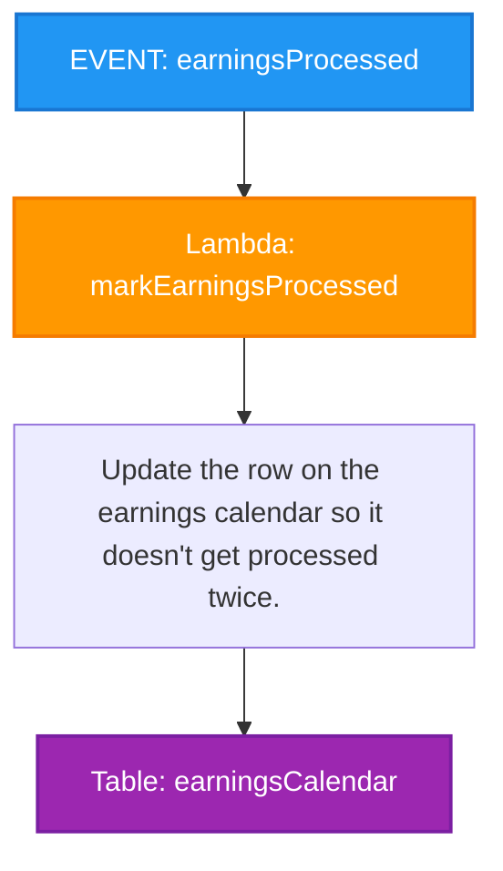

# Earnings Processed Event Handler

This diagram shows the flow for handling the `earningsProcessed` event in the Signal9 Advisor system.

## Process Flow

1. **EVENT: earningsProcessed** - The system receives a trigger that earnings have been processed
2. **Lambda: markEarningsProcessed** - A Lambda function is invoked to handle the event
3. **Update earnings calendar** - The function updates the earnings calendar table to prevent duplicate processing
4. **Table: earningsCalendar** - The database table that stores earnings calendar information

## Notes

- This is a simple event handler that prevents duplicate processing of earnings data
- The Lambda function acts as a guard to ensure idempotency
- The earnings calendar table is updated to mark the earnings as processed
- This prevents the same earnings data from being processed multiple times 