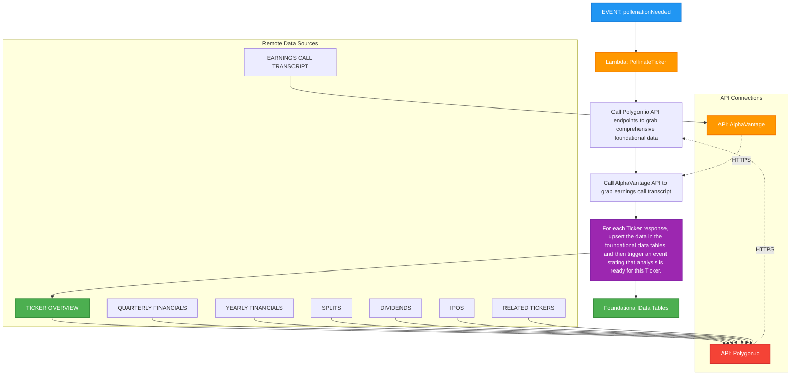

# Pollenation Needed Event Handler

This diagram shows the flow for handling the `pollenationNeeded` event in the Signal9 Advisor system, which involves fetching comprehensive foundational data from Polygon.io APIs and earnings call transcripts from AlphaVantage.

## Process Flow

1. **EVENT: pollenationNeeded** - The system receives a trigger that foundational data needs to be collected for a specific ticker
2. **Lambda: PollinateTicker** - A Lambda function is invoked to handle the comprehensive data collection
3. **Call Polygon.io APIs** - The function makes HTTPS calls to multiple Polygon.io API endpoints with Bearer token authentication
4. **Call AlphaVantage API** - The function makes HTTPS call to AlphaVantage EARNINGS_CALL_TRANSCRIPT endpoint with API key authentication
5. **Data Sources** - Multiple financial data sources are accessed:
   - Ticker Overview (company fundamentals and financial ratios)
   - Quarterly Financials (complete quarterly financial statements)
   - Yearly Financials (complete annual financial statements)
   - Splits (stock split information with execution date, split ratio, and unique identifier)
   - Dividends (dividend payment data with cash amount, currency, dates, frequency, and dividend type)
   - IPOs (initial public offering data with listing date, offer details, exchange, and security information)
   - Related Tickers (correlated securities with simple ticker-to-ticker relationship mapping)
   - Earnings Call Transcript (most recent quarter with speaker sentiment analysis)
6. **Process and Store** - For each ticker response, the data is upserted into foundational data tables
7. **Trigger Analysis** - An `analysisNeeded` event is dispatched for each processed ticker
8. **Foundational Data Tables** - Database tables that store the collected financial data

## Notes

- This is a data ingestion process that collects comprehensive foundational financial data from Polygon.io APIs and earnings call transcripts from AlphaVantage
- The process ensures data is properly stored before triggering analysis
- Multiple data sources are consolidated into a single foundational data store
- The system maintains data integrity through upsert operations
- Each ticker processed triggers its own analysis event for parallel processing
- News sentiment data is handled separately via the HourlySyncNews cron job
- **Unified Secret Management**: Single `Signal9APICredentials` secret contains all API keys and hosts
- **Polygon.io Authentication**: Bearer token (`POLYGON_API_KEY`) in Authorization header, host (`POLYGON_API_HOST`)
- **AlphaVantage Authentication**: API key (`ALPHA_VANTAGE_API_KEY`) as query parameter in URLs, host (`ALPHA_VANTAGE_API_HOST`)
- **Pagination Handling**: Many Polygon.io endpoints return paged results requiring multiple API calls
- **Rate Limiting**: Respects Polygon.io's 25 calls per minute rate limit with exponential backoff
- **Complete Historical Data**: Each Polygon.io API call returns complete historical datasets (typically 10+ years) with comprehensive financial statements (income statement, balance sheet, cash flow statement, comprehensive income)
- **Earnings Transcript Focus**: AlphaVantage call focuses on most recent quarter transcript with speaker sentiment analysis 