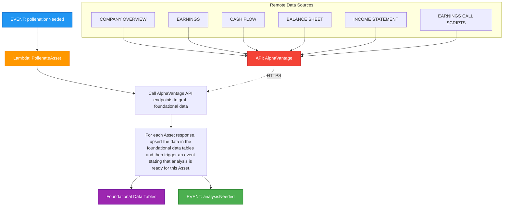

# Pollenation Needed Event Handler

This diagram shows the flow for handling the `pollenationNeeded` event in the Signal9 Advisor system, which involves fetching foundational data from external APIs.

## Process Flow

1. **EVENT: pollenationNeeded** - The system receives a trigger that foundational data needs to be collected
2. **Lambda: PollenateAsset** - A Lambda function is invoked to handle the data collection
3. **Call AlphaVantage API** - The function makes HTTPS calls to AlphaVantage API endpoints
4. **Data Sources** - Multiple financial data sources are accessed:
   - Company Overview
   - Earnings data
   - Cash Flow statements
   - Balance Sheet data
   - Income Statement data
   - Earnings Call Scripts
5. **Process and Store** - For each asset response, the data is upserted into foundational data tables
6. **Trigger Analysis** - An `analysisNeeded` event is dispatched for each processed asset
7. **Foundational Data Tables** - Database tables that store the collected financial data

## Notes

- This is a data ingestion process that collects foundational financial data from external APIs
- The process ensures data is properly stored before triggering analysis
- Multiple data sources are consolidated into a single foundational data store
- The system maintains data integrity through upsert operations
- Each asset processed triggers its own analysis event for parallel processing
- News sentiment data is handled separately via the HourlySyncNewsSentiment cron job 