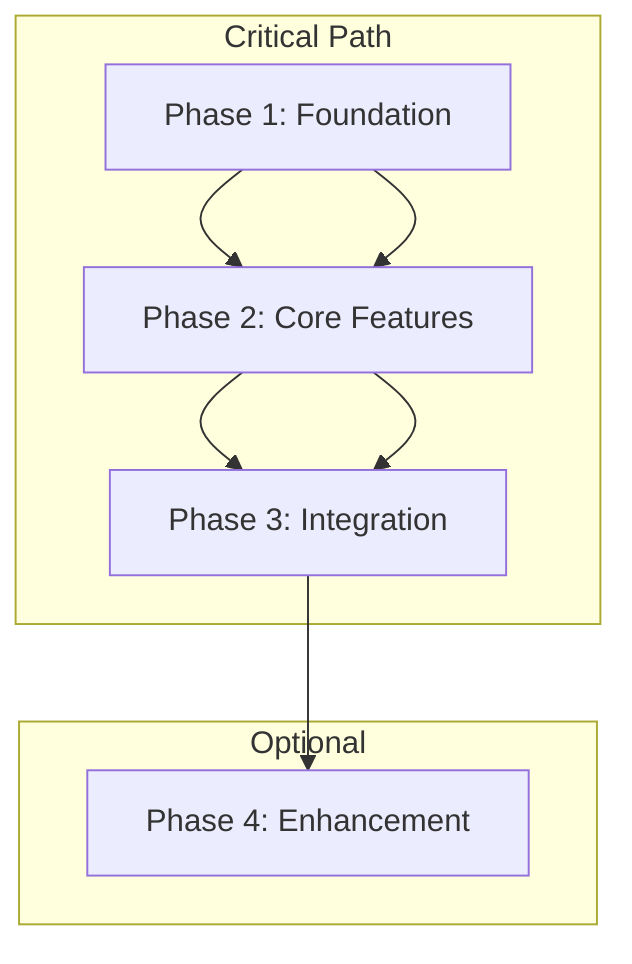

# Roadmap Format

## Format Description
A comprehensive project roadmap template for brainstorm mode. This template guides the creation of a high-level project plan with phases, dependencies, and strategic objectives.

## Roadmap Structure

# Project Roadmap: [Project Name]

## Project Overview
[High-level description of the project, its purpose, and strategic objectives]

## Strategic Context
- **Business Goals**: [Primary business objectives this project addresses]
- **Success Metrics**: [Key performance indicators for project success]
- **Timeline**: [Overall project timeline and major milestones]

## Phase Overview

(repeat for each phase)
### Phase [Phase Number]: [Phase Title]
- **Name**: [Phase Name]
- **Duration**: [Estimated time in weeks/months]
- **Priority**: [Critical/High/Medium/Low]
- **Status**: [Not Started/In Progress/Completed]

#### Business Context
- **Business Value**: [Description of value delivered]
- **Success Metrics**: [Quantifiable metrics to measure success]

#### Technical Scope
- **Components**: [Key system components involved]
- **Technical Dependencies**: [Required technical prerequisites]
- **Architecture Changes**: [Major architectural modifications]

#### Implementation
- **Key Deliverables**: [Concrete outputs expected]
- **Technical Constraints**: [Technical limitations/requirements]
- **Integration Points**: [Systems/services to integrate with]

#### Quality Assurance
- **Testing Requirements**:
  - Unit Testing: [Coverage requirements]
  - Integration Testing: [Scope and requirements]
  - Performance Testing: [Benchmarks and targets]
- **Security Requirements**:
  - Security Reviews: [Required security assessments]
  - Compliance Checks: [Regulatory requirements]

#### Risk Management
- **Identified Risks**:
  - Risk 1:
    - Impact: [High/Medium/Low]
    - Probability: [High/Medium/Low]
    - Mitigation Strategy: [Steps to mitigate]
- **Contingency Plans**: [Backup strategies]

#### Exit Criteria
- **Technical Criteria**: [Technical requirements to complete]
- **Business Criteria**: [Business requirements to complete]
- **Documentation**: [Required documentation updates]
- **Performance Metrics**: [Required performance achievements]
(end repeat for each phase)

## Phase Dependencies

## Technical Architecture Overview
- **Architecture Pattern**: [Description of the overall architecture approach]
- **Key Technologies**: [Primary technology stack and rationale]
- **Integration Strategy**: [How components will integrate]
- **Scalability Considerations**: [How the system will scale]

## Security and Compliance
- **Security Framework**: [Overall security approach]
- **Compliance Requirements**: [Regulatory and compliance needs]
- **Data Protection**: [Data handling and protection strategies]

## Monitoring and Observability Strategy
- **Metrics Strategy**: [What metrics will be tracked]
- **Logging Strategy**: [Logging approach and requirements]
- **Alerting Strategy**: [Alerting and notification approach]

## Risk Assessment and Mitigation

### High-Level Risks
- **Technical Risks**:
  - Risk: [Description]
  - Impact: [High/Medium/Low]
  - Mitigation: [Strategy]
- **Business Risks**:
  - Risk: [Description]
  - Impact: [High/Medium/Low]
  - Mitigation: [Strategy]
- **Resource Risks**:
  - Risk: [Description]
  - Impact: [High/Medium/Low]
  - Mitigation: [Strategy]

## Success Metrics and KPIs

### Technical Metrics
- **Performance**:
  - Metric: [Description]
  - Target: [Specific target]
  - Measurement Method: [How it will be measured]

### Business Metrics
- **KPI Name**:
  - Description: [What it measures]
  - Target: [Specific target]
  - Impact: [Business impact]

## Resource Requirements
- **Team Structure**: [Required team composition]
- **Skills Required**: [Key skills and expertise needed]
- **External Dependencies**: [Third-party services or vendors]

## Timeline and Milestones
- **Major Milestones**: [Key project milestones]
- **Critical Path**: [Critical path analysis]
- **Buffer Time**: [Contingency time built into schedule]

## Stakeholder Communication
- **Stakeholder Groups**: [Key stakeholder groups]
- **Communication Plan**: [How and when to communicate with stakeholders]
- **Reporting Schedule**: [Regular reporting cadence]